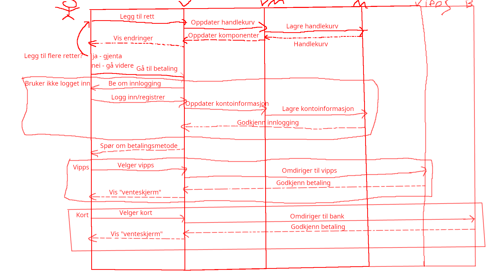

# Eksamen v22:
- Oppgave 1 - c
- Oppgave 2 - c
- Oppgave 3 - b
- Oppgave 4 - d
- Oppgave 5 - d

## Oppgave 6:
1. Lagring av lange hardkodede strenger direkte i koden. Hvis strengene er nødvendig lagre dem i en database, strings.xml fil, eller lignende.
2. Store klasser som gjør mange ting samtidig. Spiss inn klassene dine og gi dem et konkret ansvarsområde.
3. Store funksjoner som gjør mange ting samtidig. Spiss inn funksjonene dine og unngå funksjoner med mange sideeffekter dersom mulig, funksjoner skal ha en spesifikk oppgave, man skal ikke legge hele programmet i en main funksjon.
4. Uforståelige variabelnavn. Variabler skal ha forståelige navn for å øke lesbarheten til koden. Her er det også viktig å ikke ha for lange variabelnavn heller siden det også kan gjøre koden vanskeligere å lese.
5. Ubrukt kode. Å ha ubrukt kode leder til mange spørsmål for folk som ikke har jobbet med koden - hvorfor trenger vi dette? Slett koden, eventuelt legg inn kommentarer om hvorfor det er nødvendig/hva det kommer til å bli brukt for i fremtiden.

## Oppgave 7:
### Oppgave 1:
Jeg antar i denne deloppgaven at appen krever både en registrert konto og betalingsinformasjon for å plassere bestillinger. Use caset "Bestill mat" starter med at brukeren starter appen og velger maten de skal bestille. Dette innebærer benyttelse av appens "handleliste" funksjonalitet, dvs. funksjonalitet for å kunne lagre flere retter de vil bestille og lagre dem i applikasjonens minne. Etter de har valgt maten de vil bestille og vil gå videre til bestilling vil de måtte gå til appens betalingsside. I appens betalingsside vil vi umiddelbart presenteres med en alternativ flyt. Dersom brukeren ikke er logget inn i en registrert konto vil de spørres om å logge inn. Da kan de velge om de vil registrere en ny konto, eller logge inn i en eksisterende konto. Etter en eventuell registrering/innlogging vil brukeren kunne gå videre til valg av betalingsinformasjon. Her vil vi igjen møte en alternativ flyt. Hvis brukeren velger vipps vil appen omdirigere til vipps for å prosessere betalingen der. Innad i vipps vil det også kunne oppstå flere alternative flyter, men det er utenfor skopet til appen vår. Hvis brukeren velger betaling med kredittkort vil appen sjekke om brukerens konto har noen lagret kortinformasjon i appens minne. Hvis ikke vil brukeren spørres om å fylle dette ut, ellers prosesser betaling. Etter betalingen er verifisert vil brukeren få en melding om dette og kanskje en animasjon/skjerm som indikerer hvor lenge det er til de får maten sin.

### Oppgave 2:

### Oppgave 3:

## Oppgave 8-10
- Oppgave 8 - 4 
- Oppgave 9 - null
- Oppgave 10 - 4, 5, 8 (7 ved kjøretid)

## Oppgave 11:
- <rett> taggen til Spaghetti al Pomodoro retten lukkes aldri, legg inn </rett> i linjen under Spaghetti al Pommodoro.
- Indteringen på <navn> taggene følger ikke vanlige kodestil konvensjoner. Den eneste <navn> taggen som gjør det riktig er Spaghetti Vongole retten. Legg inn ett nivå indentering på de andre navnene også. Dette vil ikke føre til feil, men gir dårlig code smell.
- I tillegg er det et unødvendig mellomrom foran Saag Aloo navnet, fjern dette.

... 

## Oppgave 15:
### Oppgave a:
Velger scrum og kanban.
En fordel med å bruke scrum er at det definerer klare frister for når ting må gjøres i form av sprinter. I forhold til prosjekter med korte tidsperspektiver som IN2000 gjør dette at vi kan forholde oss til en klarere plan og forsikrer at alle oppgaver vil gjennomføres (da kanskje med varierende grad av suksess). En ulempe med dette vil også være at dette gjør at prosjektet vil trenge en forhåndsdefinert plan for hvilke ting som må gjøres innen hver frist. Dette kan være vanskelig å definere i et prosjekt med kort tidsperspektiv ettersom det gjerne må bestemmes tidlig i prosjektet, sånn at man får så mye tid til utvikling som mulig. Dette kan føre til enten forhastede valg man ideelt sett ikke burde endre underveis.

På den andre siden har vi kanban. Dette innebærer at vi mer dynamisk lager og tildeler oppgaver underveis mens vi gjerne holder styr på hvem som gjør hva med en kanban tavle. Det betyr at vi får en mer naturlig flyt og vil sannsynligvis lede til at de oppgavene som fullføres er av bedre kvalitet. Ulempen med dette er at siden vi ikke definerer klare frister kan det føre til at noen oppgaver ikke fullføres innen prosjektet.

Derfor velger mange gjerne en kombinasjon av disse - scrumban - for korte prosjekter.
