# TODO: 
- https://www.uio.no/studier/emner/matnat/ifi/IN2140/v23/ukeplan/uke-16.html 1t30
- https://www.uio.no/studier/emner/matnat/ifi/IN2140/v23/ukeplan/uke-17.html 2t06
- https://www.uio.no/studier/emner/matnat/ifi/IN2140/v23/ukeplan/uke-19.html 1t10
- https://www.uio.no/studier/emner/matnat/ifi/IN2140/v23/ukeplan/uke-20.html 1t0

# Prosesser:
## Prosess vs Tråd:
- Process krever context switch (her brukes CPU sykler for å overføre context til prosessen)
- Med tråder deler "de kjørbare enhetene"/trådene minneområde og annen global data som gjør at de slipper mye context switching. NB: De har fortsatt data lokalt for hver tråd.
- Endring fra ekskvering av en tråd til en annen er mye billigere enn fra en prosess til en annen.

## Forking:
- Hvis fork() returnerer noe annet enn 0 betyr det at det er en child-prosess
- wait() venter på at noen av barneprosessene er ferdige med sin kjøring
- execve() redigerer kjøringen av prosessen til et annet program. Kode etter en execve() vil ikke utføres ettersom execve() ikke returnerer tilbake til der funksjonen ble kalt fra.
- Rekkefølgen et program utføres i ved bruk av fork() kan være litt tilfeldig (avhenger av scheduler).

# CPU scheduling:
- Vi ønsker å schedule en prosess, tråd, jobb, e.l. 
- Utfordring - mange ønsker tilgang til prosessen, dette håndterer schedulereren hvor det finnes mange forskjellige algoritmer. Prosesser har ofte også ulike prioriteringer.
- Dispatcher: litt synonymt med schedulerer. Scheduler velger hvem som får tilgang til prosessor, dispatcher utfører handlingen av å tildele dette.
- Scheduler må optimalisere CPU utilisering. 
- Prosesser er ofte flaskehalset av enten CPU(CPU bound) eller IO(IO bound). CPU bound betyr at prosessen gjør mye kalkulasjoner på CPU med lite ventetid for IO, mens IO bound er motsatt. 
- Hvordan skal vi sortere et sett av prosesser, der noen er CPU bundet og noen er IO bundet?
	- Kjøre en type først og en annen etterpå er ueffektivt siden da er enten CPU eller disk ubrukt i lange perioder. (CPU ubrukt ved eksekvering av IO bundede prosesser, og disk ubrukt for eksekvering av CPU bundede prosesser)
	- En blandet rekkefølge av CPU bundede og IO bundede prosesser er foretrukket.

## Algoritmer for scheduling:
- FIFO (first in first out):
	Kjør prosesser til de er ferdige i en kø
	+ simpel
	+ rettferdig?
	+ veldig litt overhead
	- lang ventetid og avslutningstid
- SJF (shortest job first):
	Sorter prosesser etter kostnad og kjør dem i kø
	+ simpel
	+ bedre gjennomsnittlige tider enn FIFO
	- vanskelig å bestemme kostnad på forhånd
	- muligens lange avslutningstider og utsultning hvis nye korte jobber ankommer.
- RR (round robin):
	Dette er en variant av FIFO der vi deler opp prosesser i mindre tidsbiter (f.eks 10ms) sånn at vi unngår mange av problemene med FIFO.
	+ alle programmer får lov til å kjøre (alle prosesser får tildelt tid med en gang)
	- mange context switches kan gjøre at dette tar lengre tid totalt
	- ingen prosesser kan bli "heldige" og bli ferdige fort

## Hvordan bestemme lengden på tidsbiter for RR?
- Lange eller korte? 
	- Dette avhenger av hvor mye tid prosesser trenger på CPU sammenlignet med disk. 
		- F.eks ved tidsbit på 100ms med prosesser A,B og C der A og B kjører for evig og C løkker for evig med en alternering mellom 1ms på CPU og 10ms på disk, vil C sultes for tid på CPU (CPU bound). Dette gir oss dårlig disk utilization (5%)
		- Ved tidsbit på 1ms med de samme prosessene får vi mye høyere disk utilization (91%).
	- CPU bundede prosesser liker lange tidsbiter, IO bundede liker korte tidsbiter (siden de også avhenger av IO enheter og ikke bare CPU).

## Egenskaper en scheduler må ta hensyn til:
- Behandle like oppgaver på like måter
- Ingen prosesser burde vente for evig
- Kort responstid
- Maksimere throughput - få gjort ferdig så mange oppgaver så fort som mulig
- Maksimere bruk av PCens ressurser (mellom 40-90% er vanlig) - balanse, alle komponenter skal benyttes
- Minimere overhead - tid brukt på andre ting enn direkte prosessering
- Forutsigbar tilgang til CPU

- Kernel - ressurshåndtering, prosessor utilization, throughput, rettferdighet
- Bruker - ønsker blant annet kort responstid og konsekventhet (PCen skal ikke kræsje, programmer skal ikke f.eks ta mye lengre tid å åpne en gang)
- Brukeren av systemet: Servere vil som regel ha lengre tidsbiter, brukersystemer vil ha kortere.

## Scheduleringsklassifiseringer:
### Dynamisk schedulering:
- Tilpasser seg ved kjøretid
- Fleksibel
- Flere beregninger - mer overhead

### Statisk schedulering:
- Lager scheduleringsregler før kjøretid
- Genererer dispatching tabell for kjøretids-dispatcheren ved kompileringstid
- Trenger kunnskap om oppgaven før kompilering

## Kan man avbryte en oppgave?
### Preemptive schedulering:
- Kjøring av oppgaver kan avbrytes ("preemptes") av prosesser med høyere prioritet
- Avbrutte prosesser fortsetter senere med samme tilstand
- Mer overhead
- Real-time prioriteres fremfor best effort.
	- Real-time prosesser vil alltid kjøres hvis de finnes
- Når skal vi tillate "preemption"?
	- Preemption points - scheduler vil sjekke om det finnes noen høyt prioriterte oppgaver den må slippe til - forutsigbart overhead - liten forsinkelse for håndtering av real-time prosesser
	- Immediate preemption - nødvendig for harde real-time systemer (brukersystemer?) - mer overhead siden man må ta vare på tilstanden til den avbrutte prosessen - ingen forsinkelse for håndtering av real-time prosesser

### Non-preemptive:
- Oppgaver med høyere prioritet må vente på at oppgaven som prosesseres nå fullfører - kan også brukes uten prioritet
- Mindre overhead i forhold til context switcher
- Med prioritet har håndtering av real-time prosesser en liten forsinkelse.

I dag er dynamisk og preemptive scheduleringsalgoritmer vanligst, men alle brukes. Det fleste systemer har et slags form for prioritering.

## Prioritetsscheduling:
- Scheduler lager flere køer for hver prioritet. Alle prosesser fra kø med høyest prioritet vil utføres før scheduler går over til neste kø
	- Fordel - rettferdighet (så lenge tildeling av prioriteter gjøres riktig)
	- Ulempe - utsulting, noen prosesser må kanskje vente veldig lange - løsning: dynamiske prioriteter som endrer prioriteten på prosesser når de har ventet for lenge, men dette gir mer overhead.

### Microsoft windows 2000: Forgrunnsaktiviteter gis lengre tidsbiter siden de trenger rask responstid
- 32 prioritetsnivåer med RR i hvert nivå
- Input og throughput orientert
- De 16 øverste nivåene: real-time prosesser med statiske prioriteter som kan kjøre for evig
- De 15 neste nivåene: prioritet kan økes eller synkes med 2 nivåer. CPU bundede prosesser får redusert prioritet. IO bundede prosesser får økt prioritet. Dette er for å øke interaktivitet med systemet.
- Det siste nivået er for veldig lavt prioriterte OS prosesser
### Windows 8/10: For det meste det samme, med 2 nye grupperinger som skiller mellom prosessprioritet og trådprioritet.
- Hver prosessklasse har 7 ekstra trådprioriteter.
- For å finne den endelige trådprioriteten for en prosess tar man hensyn til begge disse
- Dynamiske prioriteter for nivå 0-15
- Bruker kan også lage egen schedulering for hver applikasjon (user mode scheduling, UMS)
- Kan også gi garanti for multimedia prosesser (MMCSS)

### Linux:
- 3 prioritetsklasser:
	- SCHED_FIFO - prosesser kan kjøre for evig uten tidsbiter
	- SCHED_RR - mykere versjon av SCHED_FIFO, tidsbiter på 10ms(quantums)
	- SCHED_OTHER - for vanlige brukerprosesser - 40 (nice-verdier) prioriteter med tidsbiter på 10ms(quantums)
- Tråder med høyest "goodness" kjører først.
	- For real-time prosesser under SCHED_FIFO og SCHED_RR: goodness = 1000 + prioritetsnivå
	- For timesharing (bruker prosesser) under SCHED_OTHER: goodness = tid igjen for prosessen + prioritet
- Quantums resettes når ingen klare prosesser har quantums igjen (end of epoch)
- Denne løsningen var ikke helt bra - gikk over til CFS
### Nyere linux - Completely Fair Scheduler (CFS):
- Bare en kø: Alle får sin rettferdige del av en tidsbit - F.eks. hvis du har en tidsbit på 10ms og to prosesser har samme prioritet deler de den tidsbiten opp i 5ms * 2
- Hver prosess sorteres etter virtuel kjøretid, de med lavest får høyest prioritet
- Bruker kun et rødsvart tre for køen av prosesser
	- Unngår å bruke mange separate køer schedulerer må søke gjennom.
	- For å finne neste prosess å kjøre går man bare lengst ned til venstre i treet
- Hvis 2 brukere køer opp prosesser vil hver bruker få 50% hver og så dele opp hver brukers tildelt prioritet på deres prosesser.

## Når skal scheduler brukes?:
- Når en ny prosess lages
- Når en prosess er ferdig
- Når en prosess blokker
- Når en prosess avbrytes
- I preemptive systemer: ved preemption points.

# Minne:
## Utfordring:
- Hvordan skal vi allokere minnet vi har?
- Hvordan skal vi finne minnet vi har tildelt?
- Hvordan bestemme hva som må ut når noe nytt skal inn (og vi ikke har plass)?
- Hvordan beskytte tildelt minne sånn at det ikke blir overskrevet?
- Hvordan forsikre at prosesser leser fra riktig minneområde?

## Hierarkier:
- Forskjellige minne har forskjellige størrelser og hastigheter. Jo raskere jo mindre kapasitet. Det er store hopp i hastighet fra et nivå til et annet.
    - Registre
    - Cache (inneholder også flere nivåer)
    - Hovedminne (RAM)
    - Sekundærminne (disk)
    - Tertiærminne (USB)

## Addressering:
- Hardware bruker *absolutt* addressering. dvs. spesielt reserverte minneområder. Dette er raskest, men veldig lite dynamisk.
    - For avlesing les absolutt byte f.eks 0x000000ff 
- **Absolutt addressering virker ikke for software**. Man kan ikke garantere at en prosess alltid vil ha det samme tildelte minneområdet.
    - MEN, man kan bruke relativ addressering. Dvs. at hvis man vet startaddressen til prosessen og en relativ addresse man kan legge til startaddressen for å finne den absolutte fysiske addressen man trenger.
        - Større kostnad, mer overhead, men gir oss støtte for **dynamisk addressering.**
- Man partisjonerer minneomrdådet til en prosess opp i tre deler:
    - Kodesegment: Dette inneholder instruksjonene for å eksekvere programmet.
    - Datasegment: Dette inneholder globale og statiske variabler. Både uinitialiserte og initialiserte.
        - Heap: Minneområde satt av for dynamisk voksende minne - *malloc()*. Heapen vokser opp mot stacken.
        - Stack: Minneområde for parametre og variabler i en funksjon. Stacken vokser ned mot heapen.
        **- Her kan det oppstå problemer om de overflower inn i hverandre.**
    - Prosesskontrollblokk (PCB): Systemdata, peker til starten av hvert segment (kodesegment, datasegment, stack).
    - På de aller høyeste minneaddressene: kommandolinjeparametre, omgivelsesvariabler. Struktur for å håndtere stacks med flere tråder.

## Globalt minneoppsett for et system:
- Laveste minneaddresser for systeminformasjon.
- Neste er OS kjernen
- Resten settes av til vanlige prosesser (+ transiente prosesser fra OSet som kan byttes ut og avbrytes)

## Minnehåndtering for multiprogrammering:
- Å ha alt i primærminne er umulig - må finne en balanse med sekundærminne
- Primitiv metode - *swapping:* Når en prosess startes lastes den inn fra sekundærminne inn i primærminne. Dette innebærer veldig mange kostbare operasjoner med å lese fra disk.
- Neste metode - *overlays:* Delegerer minnehåndtering til programmereren. Laster inn segmenter fra sekundær- inn i primær-minne når det trengs. Fortsatt ikke optimalt.
- Til slutt - *segmentering/paging*: Litt likt overlays, men lar kjernen håndtere det i stedet for programmereren.

## Fikset partisjonering:
- Deler minne inn i statiske partisjoner ved oppstart av system.
- Enkelt å implementere og støtter swapping av prosesser.

### Equal-size partisjoner (f.eks. alle partisjoner er på 8MB)
- Hvis et program krever mer minne enn størrelsen på en partisjon funker det ikke. 
- Hvis en prosess krever veldig lite minne vil dette kaste bort mye minne (en type fragmentering)

### Unequal-size partisjoner (f.eks. noen partisjoner på 2MB, noen på 4MB noen på 8MB, 16, osv):
+ Støtter bedre en blanding av store og små prosesser
- Kan skape problemer hvis man har bare store eller bare små prosesser

## Dynamisk partisjonering:
+ Deler inn partisjoner under kjøretid
    + Når en prosess opprettes blir den tildelt det minnet den trenger.
- Skaper external fragmentering når prosesser fullføres og det er fritt minne løst i minne
    + Mulig løsning - *Compaction*: flytt alle kjørende prosesser til en del av minne og det ledige til en annen del av minne - gir en stor partisjon med fritt minne. 
        - Tar tid og bruker ressurser - mer overhead.
    + Annen løsning - finne en bedre måte å allokere plass:
        - **First fit**: Starter fra starten og allokerer det første minneområdet som passer (oftest brukt av disse 3)
            + Rask og lite overhead
            - Gir ikke nødvendigvis best resultat
        - **Next fit**: Litt samme som first fit, bare at den starter å lete fra der den allokerte minne sist i stedet for fra starten som i first fit.
            + Gir bedre spredning av minne.
        - **Best fit**: Ser gjennom hele minneområdet og allokerer den minste partisjonen den finner som passer for prosessen.
            + Høres fristende ut
            - Mer overhead
            - Etter denne algoritmen har kjørt en stund sitter man ofte igjen med så mange små "ubrukelige" partisjoner at det ikke egentlig lønner seg.
        - **Buddy system**: Blanding av fikset og dynamisk partisjonering. Når en ny prosess skal få tildelt minne finner man den minste partisjonen den har plass i. Så prøver man å partisjonere den partisjonen i 2 og sjekker om den prosessen fortsatt får plass. Dette gjør man helt til prosessen ikke får plass i partisjonen hvis man deler den i 2. Når en prosess er ferdig prøver man å merge prosessens minneområde med nabopartisjonene.
            + Gode resultat
            - Enda mer overhead
            - Hva hvis du f.eks. har en prosess som krever 513kB minne? Må man da allokere en hel megabyte for denne? Løsning: ikke lagre alt kontinuerlig i minne.

## Segmentering:
- Å kreve at minnet til en prosess må lagres kontinuerlig skaper mye fragmentering
    + Løsning: segmentering.
- Dette skaper mer overhead fordi man må kunne vite hvor en partisjon slutter og den neste begynner. Uten segmentering trenger du ikke vite hvor den slutter.
    - Ekstra oppslag for addressering for å ta vare på hvilken partisjon under den prosessen når man må søke opp.

### Adresseoppslag med segmentering:
- Man må ha et **segment table** for startaddressene til hvert segment.
- Addressen er todelt
    - Først hvilket segment - øverste bitsene. Dette er en indeks i segment tabellen for å finne startaddressen til det segmentet man trenger.
    - Neste er offset fra starten av det segmentet.
- Når man har disse to kan man først lete opp startaddressen til segmentet man vil ha i segment tabellen. Så kan man legge til offsettet for å finne den absolutte adressen man ønsker.

## Paging:
- Med segmentering har vi overhead siden man tillater å ha segmenter med forskjellige størrelser så man må også ta vare på størrelsen på alle segmenter.
    - Løsning: **Paging**.
- Samme oppsett som segmentering, men med segmenter med faste størrelser.
    + Ingen ekstern fragmentering
    + Lite intern fragmentering, men dette kommer an på størrelsen på en page. (Hvis man må runde opp veldig mye kan dette skape intern fragmentering)
- Når man skal starte en prosess runder man opp til det laveste antall *pages* den prosessen trenger for å kjøre.
    - Kaster bort den lille delen minne man runder opp
    - Hvis man skal starte en prosess med et litt fragmentert minne og den ikke har kontinuerlig plass fra det første ledige stedet i minne kan man legge inn starten av prosessen der og resten ved neste ledige plass (segmentert/paget).
- Man kan også kombinere segmentering og paging

## Virtuelt minne:
- Hva hvis man skal starte en prosess når primærminne er fullt?
    - Løsning: Virtuelt minne - lagre prosessens data på disk.
- Da trenger vi en **page table**
- Man lager et virtuelt minneområde. Det virtuelle minneområdet består av en rekke pekere som kan peke både på minneområder i primærminne og på disk dersom nødvendig. 
    - Hvis man har en peker til noe på disk må man finne plass til å flytte dette fra disk inn i minnet. Det innebærer å ta noe fra primærminnet og flytte det ut til disken for å så sette det fra disken inn i den nye åpne plassen.

## Minneoppslag med virtuelt minne:
- Hvordan håndterer jeg at noe ligger på disk og noe i primærminnet?
    - Man skiller mellom virtuelle addresser og fysiske addresser.
        - Virtuell addresse: første bits for å indeksere page table, neste bits er offset fra den pagen.
        - Fysisk addresse: når du har indeksert page tabellen med de første bitsene i den virtuelle addressen sjekker du de tilsvarende bitsene på den indeksen. Når du har hentet startaddressen til pagen sjekker du om **present bit**en er 1. Hvis den er 1 kan du gjøre oppslaget som vanlig i primærminnet. Hvis den er 0 får du en **page fault**. Da må du hente dataen fra disk inn i minne først.

### Page fault håndtering:
- Vi må gjøre en context switch.
    - Vi må lagre data i registre og annen volatil informasjon
- OS finner hvilken virtuell page som er forespurt
- OS sjekker om pagen er valid og om prosessen har tilgang.
- Så kan vi hente inn pagen fra disken
    - Vi må finne plass i minne: dvs. kaste ut noe fra minne for å lage plass til det som skal hentes fra disk. Hvis element valgt for å byttes ut er "dirty" (oppdatert fra det som er på disk), må man først skrive ut de forandringene for å ikke tape disse.
    - OS finner elementet fra disk og prøver å putte det inn i minnet.
    - Når dette er ferdig vil en *"disk interrupt"* eksekveres. Nå kan vi oppdatere page tabellen med elementet hentet fra disk sin nye posisjon i minnet, det innebærer å sette present bitet i page tabellen for elementet som genererte page faulten til 1.

#### Optimalisering av paging:
- Page tabeller kan bli ganske store og de kan være ganske kostbare å søke gjennom og man jobber ofte kun med et lite område i et addresseområde så du trenger ikke hele disse tabellene.
    - Løsning: **Multilevel paging**
- Multilevel paging innebærer nøsting av paging tabeller. 
- For å kontrollere hvordan denne multilevel pagingen skal håndteres brukes det gjerne et kontroll register. Disse har forskjellig arkitektur avhengig av systemet.
- Hvis man vil søke opp et minneområde i en multilevel paging tabell må du først finne hvilken tabell du skal lete i. I den virtuelle minneaddressen brukes de første n bitsene for å søke opp i hovedtabellen etter den nøstede pagen. I denne hovedtabellen har også hver page en tilknyttet present-bit så det kan også oppstå en page fault ved oppsøk på denne page tabellen dersom denne er 0. I den nøstede tabellen bruker du de neste bitsene fra den virtuelle minneaddressen for å indeksere denne tabellen. Her kan det også hende at present-biten er 0 som igjen kan skape en page fault. Etter håndtering av denne eventuelle page faulten kan du bruke de resterende bitsene fra den virtuelle minneaddressen som offsett inn i det endelige minneområde til denne pagen.
    - Merk at multilevel paging kan gå dypere enn de 2 nivåene beskrevet her. Det innebærer en lengre virtuell minneaddresse og flere page tabell oppsøk.

#### Page replacement algoritmer:
- Hvordan skal vi velge hva vi skal bytte ut ved en page fault?
- Random, FIFO, not recently used, least recently used, osv
- Second chance: Versjon av fifo. Hvis et element aksesseres mer enn en gang settes et R bit. Ved en page fault vil det sjekkes om R bitet for det første elementet i pagen(?) er satt. Hvis det er satt vil elementet flyttes til starten av pagen med R bit satt til 0.
    - Ok algoritme, men trege ettersom listeoperasjoner er trege.
        - Løsning: **Clock** implementasjonen av second chance. Dette bruker en peker til det neste elementet. Pekeren oppdateres hver gang et element hentes fra pagen. Ved page fault vil vi sjekke om det pekeren (som nå peker på det første elementet i listen) peker på sin R bit er 0. Hvis den er 0 bytter vi ut det elementet der pekeren er. Hvis den er 1 setter vi R biten til 0 og går til neste element der vi sjekker R biten igjen.
        - Enda bedre: **Least Recently Used** (LRU). Hvis vi ser på pagen som en lenket liste oppdaterer vi listen hver gang man henter et element fra en page ved å sette det elementet fremst i listen. Ved page fault bytt ut elementet det bakerste elementet ettersom det er det som det var lengst siden var brukt. Denne algoritmen er mye mer kostbar, men er foretrukket siden den gjør at vi kan unngå dyre page faults.

#### Zero copy data paths:
- Kommunikasjon mellom flere komponenter, spesielt fra user-space ned til kernel-space er veldig dyrt. Da må man kopiere over masse data og undergå mange context switches.
    - Løsning: Zero copy data paths - lar flere komponenter og brukere dele samme minneområde ved bruk av pekere.

#### Applikasjonsspesifikke algoritmer:
- Disse algoritmene kan være lite effektive ved bruk i applikasjoner. F.eks hvis 2 personer skal spille av samme video to ganger. Løsning: applikasjonsspesifikke algoritmer

##### Least/most relevant for presentation: 
- Brukt for multimedia applikasjoner. Laster inn elementer mest relevant for presentasjon fra disk, bytter ut minst relevante for presentasjon ved page faults.
- Denne algoritmen går ut fra at tilstanden til minne representerer en snapshot av en multimedia strøm der hver COPU (continues object presentation unit) har en tilsvarende relevansverdi, f.eks. fra 0 til 1. Algoritmen tar også vare på to set med funksjoner, et for historien av multimedia allerede presentert og et for refererte elementer som er de som går inn i fremtiden.
- Relevansverdier kalkuleres ut ifra hvor nærme innholdet i et element er i forhold til det gjeldende presentasjonspunktet. Der desto lengre unna du er desto lavere relevansverdi har du. Relevansverdiene endrer seg også når presentasjonspunktet progresserer.
- Hver COPU kan også ha flere relevansverdier (f.eks. hvis det er flere klienter tilkoblet en server). Da må serveren beregne globale relevansverdier for alle COPUer som tar hensyn til alle tilkoblede klienter.
+ Få page faults (færre disk aksesser)
+ Interaktivt 
- Kostbart å beregne relevansverdier for hver COPU, men fortsatt kanskje foretrukket framfor dyre disk aksesseringer.

##### Interval Caching: 
- I motsetning til alle de andre algoritmene som har vært blokk-level caching, bruker denne strøm-avhengig caching.
- Hvis man for eksempel har 2 klienter tilkoblet en multimedia server kan man se på distansen mellom de 2 klientene for å beregne ut hvor relevant det er å beholde elementer i minne. På denne måten kan man gjenbruke elementer den ene klienten har brukt ved å cache det dersom den andre klienen er nærme nok til at det virker gunstig.
- Hvordan kan vi velge intervallene vi ønsker å cache for?
    - Sorter etter lengden på intervallene og cache et og et intervall så lenge vi har mer minne.

##### Hvilken algoritme er best for video streaming?
- LRU: Koster mye og ikke veldig bra resultater
- LMRP: Koster mest og ikke veldig bra resultater
- IC: Koster lite og gir best resultater

# Disk:
## Disker:
- Disker er trege hvorfor bruke dem?
    - Har ikke nok primærminne.
    - Primærminne er ikke persistent (slettes når pc skrus av)
- Hva med SSDer?
    - Mer liknende minne - ingen mekaniske deler.
    - Mye raskere (mikrosek vs nanosek)
    - ~10x dyrere - sjeldent i servere
- Hva består en harddisk av?
    - **Platters**: Magnetisk materiale for å gi persistent lagring av bits
    - **Spindle**: Platene roterer rundt denne
    - **Tracks**: Alle plater deles inn i disse konsentriske sirklene
    - **Sectors**: Hver track deles inn i flere sektorer på en fast vinkel. Sektorer separeres av ikke magnetiske gaps som kan brukes for å identifisere starten på en ny sektor.
    - **Cylinder**: En samling av plater (muligens brukt på begge sidene av platen) sine tracks som ligger samme avstand fra spindlen kalles et sylinder.
    - **Disk head**: Flyttes fram og tilbake fra nærmest spindel til ytterste sektorer på kanten. Leser og endrer bits under den når platene roterer.
    - Lagringskapasitet påvirkes av disse delene:
        - Hvor mange plater har vi? Brukes disse på begge sider?
        - Hvor mange tracks har vi på hver plate?
        - Hvor mange sektorer deler vi hver track inn i (gjennomsnittlig)? Hvor stor er en sektor?

## Disk aksessering:
- Må posisjonere disk hode over tracks i riktig rekkefølge 
    - **Seek time**: Først flytte diskhodet over riktig track. Hastigheten på dette avhenger av hvor mange spor man skal flytte seg over. For å beregne dette må man finne tiden for å starte og slutte søkingen + aksellerasjonen for å komme opp og ned i fart. Det er billigere per spor å flytte seg over mange spor, enn det er å flytte seg over få spor på grunn av aksellerasjonstiden. Dette tar vanligvis et par millisekunder.
    - **Rotational delay**: Vente til platen roterer nok til at det første bitet man skal lese ligger under diskhodet. Hastigheten på dette avhenger av hvor langt unna hodet, den blokken man skal lese fra er, i tillegg til hvor raskt (RPM) platene roterer. Vanligvis også noen millisekunder.
        - **Transfer time**: Vente til platen roterer nok til at alle de etterspurte bitsene har passert diskhodet. Hastigheten på dette avhenger av hvor mye man skal lese fra sporet(?) i tillegg til hvor raskt platene roterer og hvor tett dataene ligger. For å regne ut dette tar man mengden data man skal lese delt på *transfer rate*. Transfer rate finner man ved å ta mengden data per spor delt på tiden det tar for en rotasjon. Man kan også måtte endre spor å lese fra og da må man også ta hensyn til flytting av hodet.
    - **Other delays**: Venting i kø, venting på ressurser (ikke relevant, ofte lik 0)
- Tradeoffs: **Kapasitet vs hastighet**
- Forskjell mellom lese- og skriveoperasjoner:
    - Må allokere plass
    - Må ofte verifiseres at det har blitt skrevet riktig informasjon - tar lengre tid
    - For modifikasjon kombinerer man lesing og skriving.

## Optimilasering av disk aksessering:
- En treg algoritme med få disk aksesseringer vil antageligvis være bedre enn en rask algoritme med mange disk aksesseringer (se mer under Minne)
- Endre blokkstørrelse 
- Endre diskscheduling
- Plassere data i fornuftige posisjoner sånn at data som sannsynligvis kommer til å hentes sammen ikke ligger langt fra hverandre.
- Cache ting i minnet
- Prefetch (f.eks. hvis vi ser på video og har sett frame 1 & 2 kommer vi antageligvis til å trenge frame 3 & 4)
- Kombinere disker vha. RAID

## Disk scheduling:
- Mye dyrere å avbryte en diskoperasjon enn prosesss scheduling - Da dobler man søketiden, som er veldig dyrt.
- Bedre å optimalisere rekkefølgen data hentes på for å minimere bevegelse på disken. OSet tar seg av dette.
- Generelle mål: 
    - Kort responstid
    - Høy throughput
    - Rettferdighet
- Tradeoff: seek effeciency vs max response time
- Kompliserende faktorer:
    - OSet får ikke alltid riktig informasjon om disken. Her må diskkontrolleren må oversette.
    - Hvis noe blir fysisk ødelagt vil disken prøve å gjennoprette den ødelagte dataen. Dette er derfor noe plass settes av i tilfelle noe feil skjer. Når OSet sorterer forespørslene (se disk scheduling algoritmer) kan det hende denne sorteringen blir feil siden dataen kanskje ikke ligger der OSet tror.
    - De indre og ytre sylindrene har ikke faktisk like mye plass (omkretsen på de indre er mindre enn de ytre).
        - Her er det to muligheter: vanlig CAV disker (Constant Angular Velocity) og Zoned CAV disker. Med vanlig CAV flytter disken seg like raskt uansett hvor du skal lese fra og mengden data ytterst og innerst er den samme. Zoned CAV disker (det man bruker i dag) deler disken inn i soner basert på hvor langt unna spindlen du er. De ytre sporene har da mer kapasitet enn de indre.
    

### Disk scheduling algoritmer:
- First come first serve: FIFO - lang søketid, kort responstid 

- Shortest seek time first: Sorter forespørsler etter distanse fra hodet - kort søketid, lengre responstid. Hvis det er mange forespørsler rundt hodet kan det føre til utsultning for forespørsler lengre vekk fra hodet. 

- SCAN (elevator): Kompromiss mellom FCFS og SSTF. Bidireksjonell. Først start med å gå i en retning. Sorter forespørsler etter det som er nærmest hodet, men alle forespørsler som ligger bak hodet legges bak de som ligger foran i køen av operasjoner.
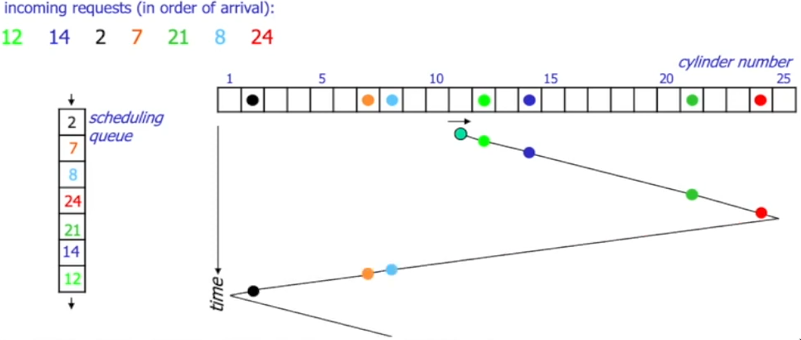
- C-SCAN (Circular SCAN): Optimalisering av SCAN. uni-directional - dette gjør at vi slipper å aksellerere når vi skal endre retning. Når vi kommer til slutten i den valgte retningen går vi heller videre tilbake til starten før vi fortsetter videre. Bedre i fleste tilfeller, men vanlig SCAN kan være raskere hvis det er få forespørsler.
- Look og C-look: Optimalisering av SCAN og C-SCAN. I stedet for å gå mellom de helst ytterste og innerste sylindrene, går man mellom de ytterste- og innerste forespurte sylindrene.
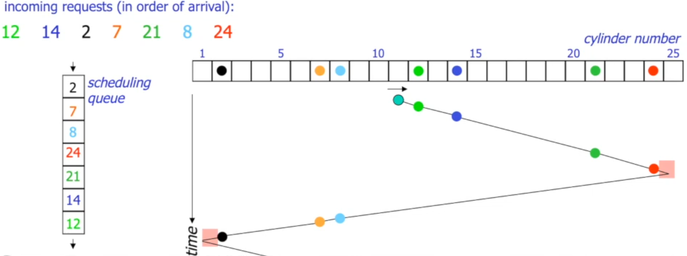

## Moderne diskscheduling:
- Caching: Når OSet spør om å hente noe fra disk er det ikke sikkert man faktisk går helt til platene, siden disken gjerne har et cache.
    - Måten dette gjøres på er at når man skal lese noe fra disken leser man hele sporet, og kanskje noen nabospor også, og kopierer dataen herfra inn i et minnebuffer der vi har satt av litt plass i minnet for caching. Hvis noen av denne cachede dataen blir forespurt senere slipper man da å gå helt ned på disken igjen. 
    - Hvor stort skal dette bufferet i minnet være?
    - Hvor mye data skal vi prefetche? 
    - På Windows:
    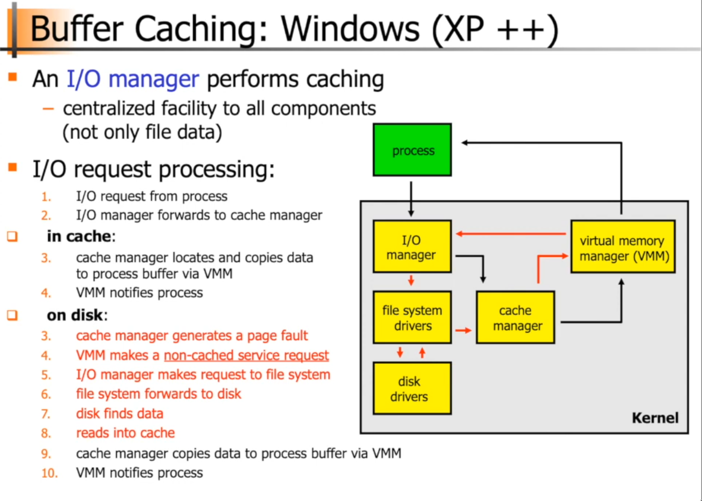
    - På Linux:
    
    - For caching strukturen brukes gjerne en LRU algoritme. I tillegg brukes en hash tabell der man kan hashe filnavn og blokknummer for raskere oppslag av den blokken. På den måten slipper du å søke gjennom hele listen.
- NOOP (FCFS med request merging, brukt i linux) merger sammen flere forespørsler for å spare tid. Denne algoritmen funker på ikke mekaniske disker siden de ikke har noe søketid.
- Deadline I/O 
    - C-SCAN basert
    - 3 Køer: 1 sortert (elevator) kø, og 2 deadline køer (read/write)
    - Anticipatory er en versjon av denne algoritmen som venter litt for å prøve å slå sammen flere forespørsler.
- Completely Fair Queuing (CFQ): en kø for hver prosess der hver kø får en periodisk aksess. Hvor lenge denne perioden er avhenger av hvor mange brukere som er venter på køen. work-conserving: hvis en prosess ikke bruker tiden sin går man over til neste mens man er på disken.
    - Kan man optimalisere diskscheduling fra applikasjonen? - ja, OSet vet ikke alltid best.

## Plassering av data på disk:
- **Interleaved**: Minimal disk arm bevegelse hvis man har et forutsigbart mønster for forespørsler. Ingen gevinst hvis vi har et uforutsigbart mønster.

- **Contiguous**: Minimal disk arm bevegelse hvis man leser en hel fil. Ingen bevegelse av hodet når man leser fra én fil (ingen søketid, rotasjons forsinkelse). Vanligvis vil man lese fra andre filer i tillegg som gjør at vi kan få store søk fra en fil til en annen.

- **Organ-pipe**: Plasserer oftest forespurte blokker i midten av disken siden det er der hodet i snitt trenger å gå kortest for å aksessere (bell-curve for hvor ofte blokker plasseres).
    - **Modified Organ-pipe**: Forskyver 'midten' litt lenger utover der det er plass til mer data og data kan leses raskere.

## Filer:
- En sekvens med bytes. I noen systemer tas det også hensyn til hva disse bytesene representerer når de leses, men vi ser på dem som **ustrukturerte filer**
- Filsystemet:
    - **Storage management**: allokere plass, finne blokker, sortere sånn at de hører sammen.
    - **File management**: Hvem eier filen, hvilke tilganger har hvilke brukere?
- Open:

- Read:

- VOP_READ(): Dette er en virtuell funksjonspeker. Dvs at det er en funksjon som peker på en annen funksjon avhengig av miljøet den kalles fra.

- getblk(): følg den lenkede hash listen. Hvis du ikke finner blokken i hash listen betyr det at vi ikke har blokken i cachet. Ifølge LRU bytter man da ut det least recently used elementet (i bildet den gule L'en) og legger inn blokk i cache.

- VOP_STRATEGY: Også en virtuell funksjonspeker. Avhenger av hva slags disk den skal lese fra. Den initierer endelig lesing fra selve disken. Etter dette er ferdig returnerer man tilbake til getblk() og oppdaterer hash listen, det innebærer å kaste ut det least recently used elementet og omorganisere lenkene i listen. Til slutt sender man en interrupt som sier at dataen ligger klar i buffercachen som gjør at man kan returnere til applikasjonen.
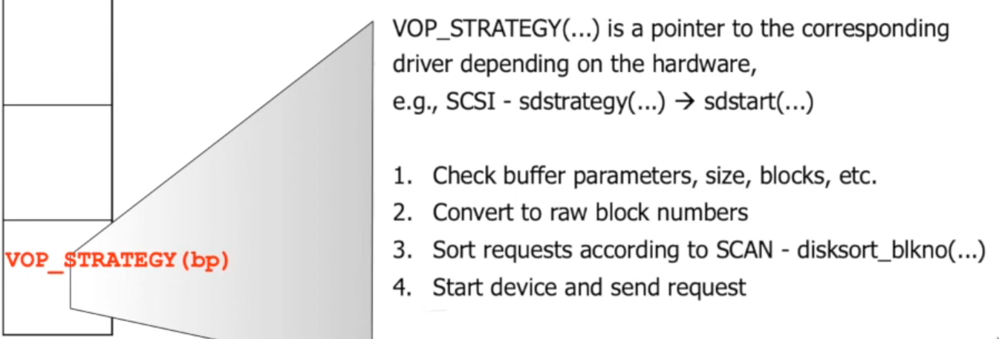

### Filsystemet 
- Hvordan finne riktige blokker på disken?
- **Chaining i media**:
    - Filsystemet har metadata om hver fil, metadataen er bare en peker til den første diskblokken. Alle andre diskblokker er lenket mellom hverandre som en lenket liste.
        + Fint for små filer eller sekvensiell lesing.
        - Dyrt å søke etter blokker midt i en fil (må gå gjennom alle foregående ledd i listen).
- **Chaining i et map**:
    - Filsystemet inneholder en tabell. Hvert element i tabellen inneholder en peker til en filblokk og en indeks til den neste pekeren til en anne filblokk. I stedet for å søke gjennom alle filblokkene kan du søke gjennom mapet i stedet (billigere).
        - FAT (File Allocation Table):
            - Boot sektor
            - 2x tabeller beskrevet ovenfor
            - Root dir 
            - Andre dirs
        - Tabellen kan fortsatt bli ganske stor å søke gjennom - løsning: **Table of Pointers**
- **Table of pointers**:
    - Hver fil har en egen tabell med pekere på samme måte som i **Chaining i et map**.
    - Inoder - hver fil/dir har en del metadata og pekere. ~12 pekere ~4KB for dataen i en fil - ikke nok for mange filtyper, derfor har inoder også *Single-, Double- og Triple- indirect* pekere som er pekere til egne diskblokker som holder på flere pekere til andre diskblokker. 
        - Single indirect: inneholder en peker til en(eller flere?) diskblokk med pekere til andre diskblokker med data
        - Double indirect: inneholder en peker til en diskblokk med pekere til andre disklblokker som peker på diskblokker med data.
        - Triple indirect: inneholder en peker til en diskblokk med pekere til andre diskblokker som inneholder pekere til andre diskblokker med data.
        - Indireksjon fører til unødvendig mange diskoperasjoner - dyrt.
- **Extent-based allocation**:
    - Samle filene så godt som mulig. Da kan vi optimalisere metadatastrukturen.
    - Metadataen inneholder en peker til starten av filen i tillegg til en teller for hvor mange blokker filen inneholder.
    + Raskere allokering
    + Færre oppslag, kan lese data kontinuerlig (færre context switches?)
    + Metadataen er mindre
    - Brukt i XFS, JFS, EXT4, med en ny inode struktur.
    - **EXT4**:
        - En inode inneholder et array av pekere.
        - Arrayen av pekere bruker de allokerte bytesene til å først beskrive en header (hva slags pekere er det, direkte eller indirekte), så de neste bytesene på å lage extents (pekere) som inneholder 4 felter.
            - Hvilket blokknummr pekeren er
            - Den fysiske addressen på disken (delt opp i to variabler, 1x32 bit + 1x16 bit)
            - Hvor mange elementer ligger etter hverandre på disken.
        - Uten indireksjon kan man kun addressere 4x128MB=512MB med en extent. Løsning: definere i header om extenten er et HTREE (grunt og bredt for raske oppslag) av extents.
            - I dette tilfellet peker inoden på den fysiske addressen på disk til en blokk som inneholder blokkstørrelse (f.eks. 4KB) * størrelsen på en extent. Extentene på disken kan eventuelt også være flere pekere til andre extents som vil gi oss enda større addresserom i bytte mot hastighet.
    - **NTFS**:
        - Hver partisjon har en **Master File Table** som er en linæer sekvens av 1KB records. Hver record beskriver en dir eller en fil, med attributter og addressene. 
        - Første 16 bytes er reservert for metadata til filsystemet. 
        - Hver record har metadata og runs (samme som extents).
        - Hvis en record ikke er nok for en fil lages ekstra records kalt extension records. Indeksene i MFTen for ext recordsene legges så inn i base recorden.
        

### Flere disker:
#### Striping:
- Fordele datablokker på flere disker og lese fra alle disker parallelt.
    + Raskere transfer rate enn ved en disk
    - Kan ikke betjene flere brukere samtidig
    - Hvis diskene har forskjellig hastighet kan man måtte vente på at den tregeste blir ferdig
- **Interleaving (Compound Striping)**:
    - Ikke aksesser alle samtidig, men fordel forespørslene over diskene og les i sekvens.
    - Lag disk grupper som kan brukes paralellt for flere brukere (en bruker per disk).
        - Hvis flere brukere prøver å aksessere samme disken samtidig har vi samme problem - løsning: staggered striping.
    - **Staggered striping**:
        - Hvert element 'stripes' på tvers av disker, dvs. at f.eks. kan du ha halvparten av et element på en disk og resten på en annen.
        + Flere brukere kan betjenes parallelt.
        + Mer effektive diskoperasjoner
        + Muligens raskere responstid.
        - Flere brukerer kan fortsatt prøve å aksessere samme diskgruppe.
- **Redundant Array of Inexpensive Disks (RAID)**:
        - **RAID 0**: stripet disk array uten redundans, bare for ytelse uten sikkerhet.
        - **RAID 1**: speiling, dvs. 2 kopier av det samme innholdet som gjør at vi kan lese fra 2 disker samtidig.
        - **RAID 2&3**: lite brukt - er på bitnivå.
        - **RAID 4**: striping på alle utenom den ene disken. Den siste disken brukes som paritetsdisk. Det gjør at dersom den ene disken går i stykker kan man gjenopprette fra paritetsdisken.
            - Skriveoperasjoner kommer til å gå til paritetsdisken for å oppdatere backupen, dette gjør at paritetsdisken blir en flaskehals.
        - **RAID 5**: løsning på problem med RAID 4 - i stedet for å ha en designert paritetsdisk fordeler vi pariteten på tvers av alle diskene. 
        - **RAID 6**: Sett av to typer paritetsblokker for å håndtere 2 feil samtidig.
        - Man kan også lage kombinasjoner av disse f.eks. RAID 10 eller RAID 0+1

### Hva med filsystemer over nettverk?:
- **Network Attatched Storage (NAS)**: disken og filsystemet er på en fjern server.
- **Storage Area Network (SAN)**: bare disken er på en fjern server, filsystemet lagres lokalt.
- **Network File System (NFS)**: Pakker funksjonskallet sendt fra applikasjonen og sender dem ned til kommunikasjonssystemet og sender det over til RPC mottakeren som pakker funksjonkallet opp og sender det videre til NFS mottakeren som kaller det lokale filsystemet og går ned på disken. Når dataen er lest inn pakkes det ned igjen og sender det tilbake til avsenderen av forespørselen.

# Inter-Process Communication (IPC):
- Hvordan kommunisere imellom prosesser på samme maskin? Her kan man anvende mer effektive løsninger enn det som brukes for kommunikasjon over nettverk.
- Intro:
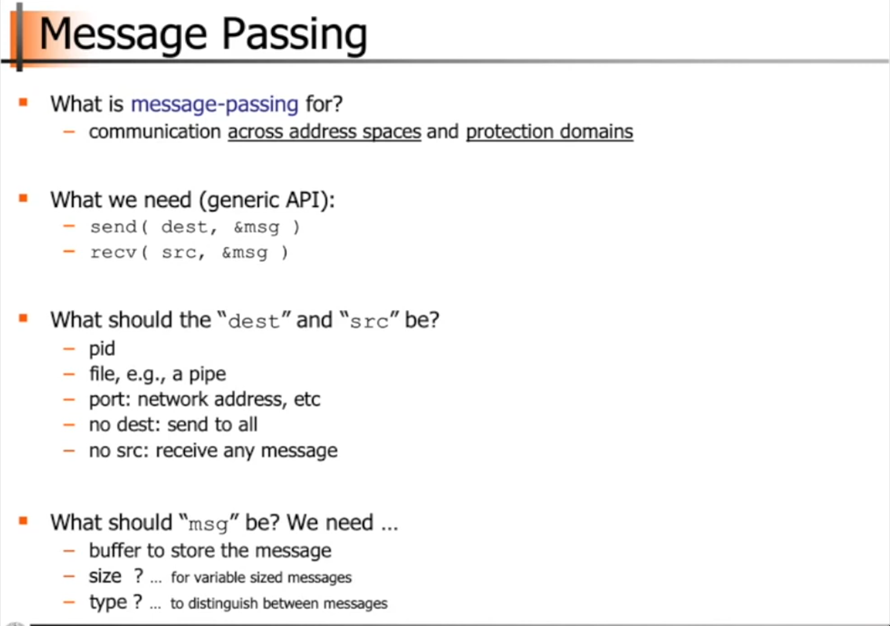
- Indirekte kommunikasjon: Man forholder seg ofte til et mellomledd både avsender og mottakere sender til og leser fra (se på det som en mailbox). 
- Mailboxes: Meldinger køet opp som FIFO for hver ID. Meldinger kan også gis typer. Hvis man ønsker å hente ut en spesiell type fra en kø må man ta hensyn til dette og passe på at man ikke henter ut feil type, må også oppdatere køen dersom det forespurte elementet ikke faktisk var først i køen.

- Pipes:
    - Oppretter nye prosesser for hver kommando. | kaller på systemkallet pipe. 
    - Hvis vi ser på kommandoen `ls -l | more` vil systemkallet Pipe opprette et minneområde og 2 fildeskriptorer, en for lesing og en for skriving. Vi får også en inode for pipen. Denne inoden vil ha en peker til pipen, en lengde, en start, samt informasjon om lesere og skrivere til pipen. Så setter den i gang prosessen til `ls` som vil skrive ut outputen sin til det dedikerte minneområde for pipen. Mens den skriver outputen sin vil den også endre på lengden i inoden til pipen. Hvis vi oppnår maksimal lengde før `ls` er ferdig vil vi måtte vente. Når `more` da skal begynne å lese ut fra pipen bruker den start pekeren i inoden og leser så mye som den klarer, eller helt fram til lengde variabelen. Etter den er ferdig med å lese oppdaterer den start variabelen til der den glapp av og senker lengde variabelen med like mye som den leste.
- Mailboxes vs. Pipes:

- Shared memory:
    - Når to brukere har hver sine addresserom oppretter de et fysisk minneområde som mappes inn i addresseromene til begge brukerne. Da kan begge brukerne både skrive til og lese fra dette minneområdet. Utfordring: overskriving av hverandres variabler.
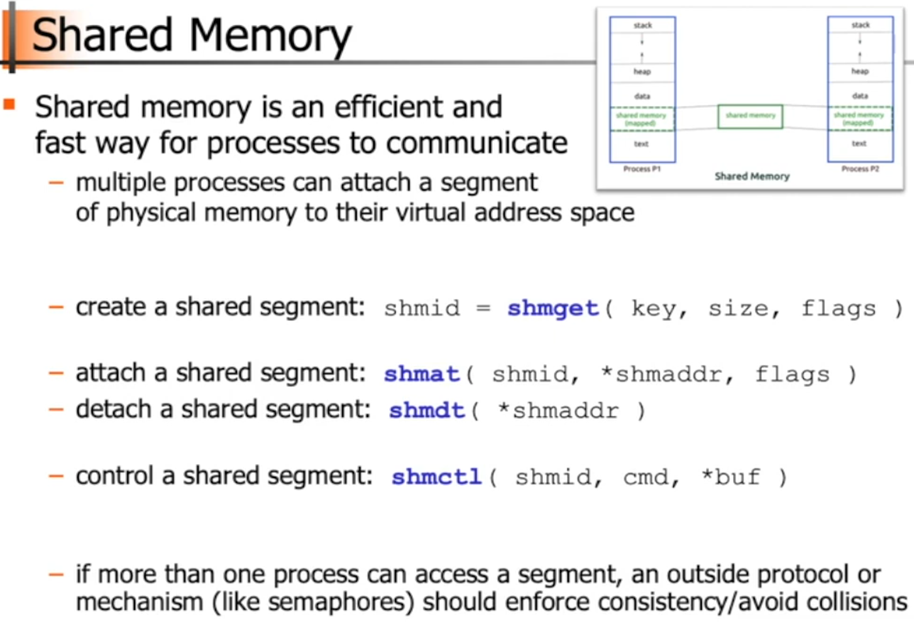
- Signals:
    - To måter å sende signaler: kill() og raise()
    - For å håndtere signaler: signal()
        - Man kan redefinere hva et signal skal gjøre ved å peke til en egendefinert funksjon ved fanging av signaler (`signal(sig_nr, void (\*func) ())`). Når man gjør dette vil ikke default betydningen utføres, heller denne egendefinerte funksjonen.

# Datakommunikasjon:
## Nettverk strukturer:
- Nettverk komponenter: 
    - **Endesystem**: Noder som ikke frakter nettverkpakker videre til andre noder. F.eks. datamaskiner, gatelys, branndetektorer, osv.
    - **Intermediate system**: Noder som viderefører pakker til andre noder. F.eks. modem, ruter, switcher, web proxy, osv.
- Nettet kan ses på som en graf der det er kanter mellom noder. Noder vil være et endesystem eller et intermediate system og en kant vil være en kobling mellom to noder.
- **Point-to-point channels**: 
    - Docsis: Et sentralt intermediate system som kobler sammen alle endesystemene i et nettverk. Stjerne topologi
    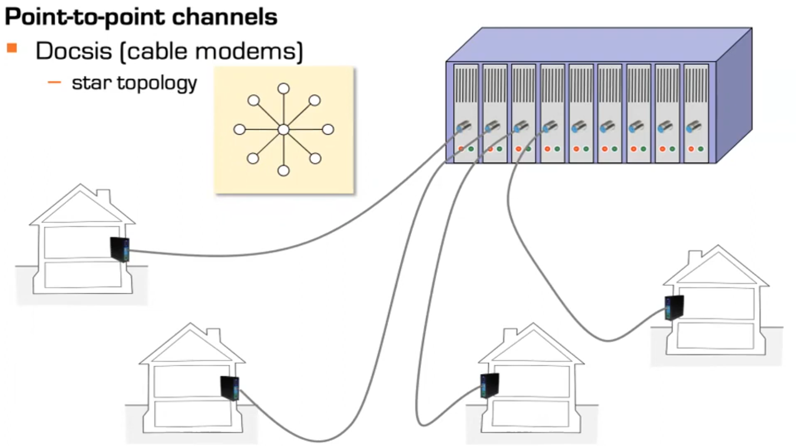
    - Gigabit ethernet: Stjerne eller tre topologi.
    
    - Andre strukturer:
        - Full mesh: alle noder er koblet mot hverandre - for mange kabler og tilkoblinger når det er mange noder.
        - Hypercube: Mye brukt
        - Torus: God skalerende topologi ettersom en node aldri trenger flere kanter dersom nettverket vokser.
        - Ring: Ikke brukt
    
- **Broadcasting kanaler**: Hvis en node sender kan alle andre høre på den. Problem: hvis to meldinger sendes samtidig kan de kollidere - dette må håndteres. Her kan man f.eks. sende et signal om at meldingen har blitt ødelagt og må sendes på nytt.
    - Kabel: Gammel ethernet brukte dette
    - Radio: Typisk bruk for dette i dag - trådløst. For å hindre kollisjoner: ikke sende med mindre mottakere har sagt at de vil høre etter.

## Nettverkets oppgaver:
- Hvert par av intermediate systems må kunne veien til hverandre for å kunne videreføre data gjennom grafen.
- Nettverket må vite hvordan man skal finne veien fram til de riktige endesystemene. Her må de også finne veien til den riktige prosessen på det mottakende endesystemet.
- Nettverket må vite veien tilbake fra et endesystem til et annet
- Finne riktig måte å enkode data slik at maskiner kan forstå hverandre (f.eks. hvis en little endian og big endian maskin kommuniserer)
- Må kunne finne alternativer dersom noe går galt. F.eks. hvis et IS ødelegges må det finne en alternativ sti gjennom grafen.
- Opprettholde sikkerhet og privathet.
- Støtte høy traffik

### Applikasjoners behov:
#### Filnedlasting:
- Unngå høy forsinkelse - Ikke kritisk (kan være irriterende men mindre forsinkelser er tolererbare)
- Støtte høy traffik - Ikke kritisk
- Håndtere nettverkproblemer - Kritisk - hvis man f.eks. skal overføre penger i banken må dette håndteres ordentlig om det skjer noe feil over nettet.
#### Text-chat:
- Unngå høy forsinkelse - Ikke kritisk (kan være irriterende men mindre forsinkelser er tolererbare, mennesker klarer ikke skrive raskt nok for dette)
- Støtte høy traffik - Ikke kritisk 
- Håndtere nettverkproblemer - Kritisk - Alle meldinger må komme fram til mottakeren
#### Streaming av media:
- Unngå høy forsinkelse - Noe er ok
- Støtte høy traffik - Kritisk 
- Håndtere nettverkproblemer - Noe er ok (Hvis noen piksler mangler fra video er det tolererbart)
#### Haptisk interaksjon (f.eks. spill):
- Unngå høy forsinkelse - Kritisk (bruker må kunne reagere på hendelser fortløpende)
- Støtte høy traffik - Ukritisk (kommer an på tjenesten(?))
- Håndtere nettverkproblemer - Noe er ok (Hvis noe går tapt går det fint)

## Strukturering av oppgaver:
- **Lagdelt fremgangsmetode** - Brukes i dag
    
- **Komponent fremgangsmetode**
    + Hvert lag kan dele komponenter - slipper å duplisere funksjoner 
    - Trenger veldig fleksible algoritmer for å kunne dele dem på tvers av lag
    - Vanskelig å bli enig om hva å velge over et større nettverk med mange ulike systemer
    
- **Rekursiv fremgangsmetode**
    - Se på utfordringer lokalt først - hva trengs for å kommunisere med min direkte nabo?
    - Mye signaleringsoverhead for å sette opp en sti
    

## Layering model:
- To modeller: ISO OSI (Open Systems Interconnection) Reference Model og TCP/IP Reference Model Internet Architecture. 
    - OSI er mer teoretisk, TCP/IP brukes i praksis

### OSI:
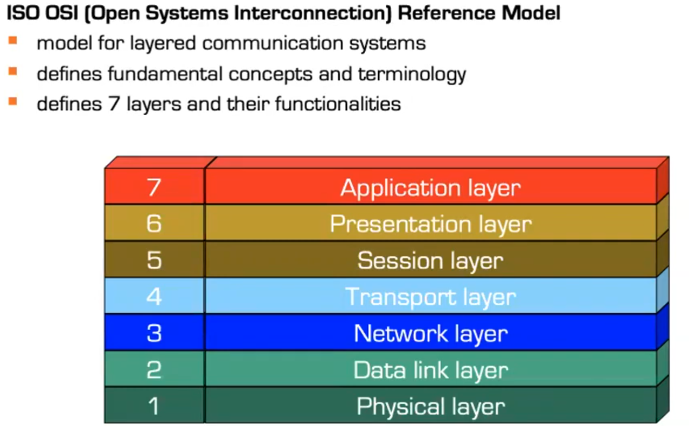
- Fysiske laget: Sende bits mellom to direkte naboer i et nettverk - kan være wifi/4g/kabel osv.
    - Hvordan koble nettverksadapterne  
    - Hvilke elektroniske kretser trengs (ikke med implementasjon)
    - Hva slags prosedyre trengs for å kommunisere med naboene (send melding ut for å spørre om nabo er klar for å motta pakker før den sender, enten over kabel eller med radiobølger)
- Linklaget: Skaper større enheter ut av bitsene (bytes) gjør dem om til frames (rammer)
    - En ramme består av: en start og en slutt (markeres ved et kjent bitmønster), en mengde data, og en checksum som hjelper med oppdaging av mulige feil som kan oppstå under transport.
    - Ansvar deles opp i to underliggende lag Logical Link Control (LLC) (rettet mot lag 3, detekterer feil i rammer og muligens forkaster ved feil) og Medium Access Controll (MAC) (Vi forholder oss mest til MAC, rettet mot lag 1, definerer hvordan en ramme ser ut). LLC muliggjør blant annet at vi kan ha et og samme internet for både trådfast og trådløst selv om de begge krever separate MAC lag, siden vi i dette tilfellet bare har et LCC lag. MAC laget finner nabo noden med sin MAC addresse, så bestemmer den om meldingen skal sendes enda eller om den skal vente på andre noder i nettet for å unngå kollisjon og bestemmer hvor stor rammene skal være.

- Nettverklaget (IP): Har ansvar for å sende pakker uavhengig av hverandre fra et endesystem til et annet. Finner hvordan addressene ser ut og hvordan man finner en sti fra en addresse til en annen - dette kalles routing. Laget abstraherer nettverket til en graf sånn at den kan bruke algoritmer for å finne den *beste* stien avhengig av en rekke parametre. Hvis addressene ser annerledes ut må nettverklaget også oversette dette. Hvis for mange pakker bruker samme sti kan nettverklaget også fikse dette - i værste fall forkaste noen pakker, beste fall finne en annen sti. Nettverklaget har også ansvar for metning(skontroll?). Det vil si at dersom det er flere avsendere til samme mottaker som gjør at ikke alle pakker kan sendes i full hastighet må nettverklaget håndtere dette - lage et minnebuffer der pakkene kan ligge fram til de kan sendes? forkaste noen pakker? Til slutt ansvar for å levere pakker opp til lag 4. 
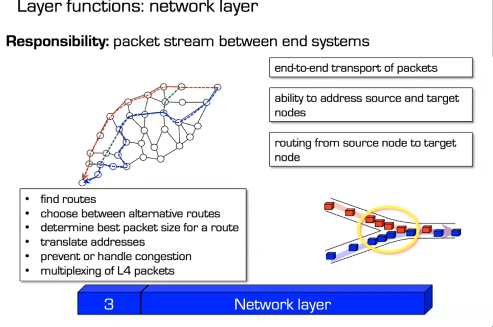
- Transportlaget (TCP/UDP): Nettverklaget sender bare pakker mellom systemer - transportlaget skal så finne hvilke prosesser pakkene skal fram til. Legger til ekstra informasjon nødvendig for å finne prosessene når den sender pakker med nettverklaget. Skaper en relasjon mellom prosessene på ulike endesystemer. Dersom du har to prosesser som henter data fra samme endesystem må transportlaget håndtere hvilken prosess som skal motta hvilke pakker fra det andre endesystemet. På samme måte må transportlaget også tilby applikasjoner som sender flere strømmre med data til samme endesystem en måte å skille mellom formatet på de ulike dataene. Transportlaget håndterer også hastighetsforskjeller mellom avsender og mottaker. Dette kan gjøres ved å redusere hastigheten avsenderen kan sende pakker eller ved å forkaste pakker. Laget fikser også feil på endesystemer uten innflytelse på stien gjennom nettet.

- Session layer: Skaper en strukturert dialog mellom prosessene på endesystemene. Sesjoner skal støttes over lengre perioder - også på tvers av ulike nettverk. Identifiserer brukere og passer på hvilke tilganger brukerne har.
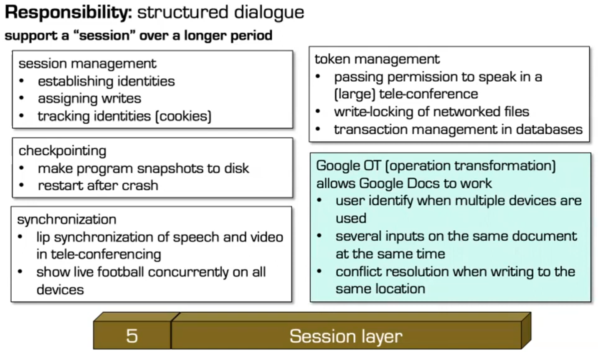
- Presentasjonslaget: Skal fikse ulikheter mellom endesystemer. 
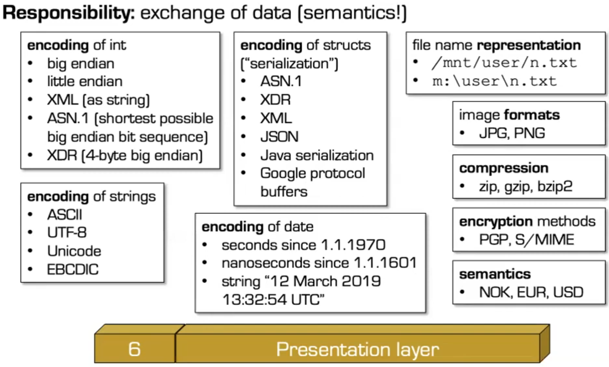
- Applikasjonslaget: Alt annet! Benytter seg av funksjonalitet fra lagene under. Utvikleren kontrollerer hva som gjøres her.

- I mellom to endesystemer er hvert lag en *peer*. Det vil si at alle protokollene i hvert lag må passe på tvers av endesystemer. Fysisk vil kommunikasjon mellom endesystemer gå ned gjennom lagene for å sendes fysisk av en avsender, før det kan rekonstrueres gjennom de samme protokollene av mottakeren. Dersom det skal sendes gjennom et intermediate system vil ISet kun rekonstruere pakkene opp til nettverklaget ettersom det ikke trenger å vite noe mer for å kunne videresende relevant data.

### TCP/IP modellen:
- Laget i konkurranse med OSI. Består kun av 5 lag - ingen session og presentasjonslag. I tillegg kombineres ofte lag 1 og 2 til et lag (Network interface model).
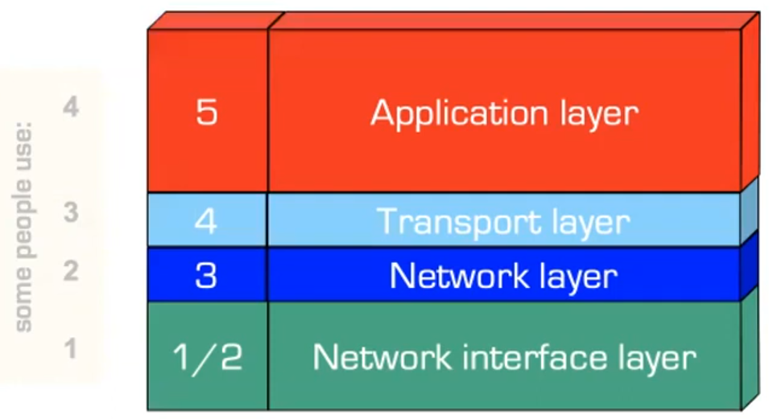
- Nettverkslag og transport lag funker som i OSI, men applikasjonslaget må ta seg av oppgavene til presentasjonslaget og sesjonslaget.
- Det er kun lag 1-4 som er essensielle for å kunne kommunisere over internettet så disse vil forbli noenlunde det samme uansett. Disse lagene er også som regel definert i kjernen. Altså kan man ikke endre deres funksjonalitet direkte fra våre applikasjoner. De andre øverste 3 lagene er det utviklerne har kontroll over. Siden det er utviklerne som bestemmer hvordan dette skal implementeres er det ikke nødvendig å opprettholde standardiserte protokoller for disse lagene. Det er derfor TCP/IP modellen ikke har noen spesifikke retningslinjer for disse lagene.
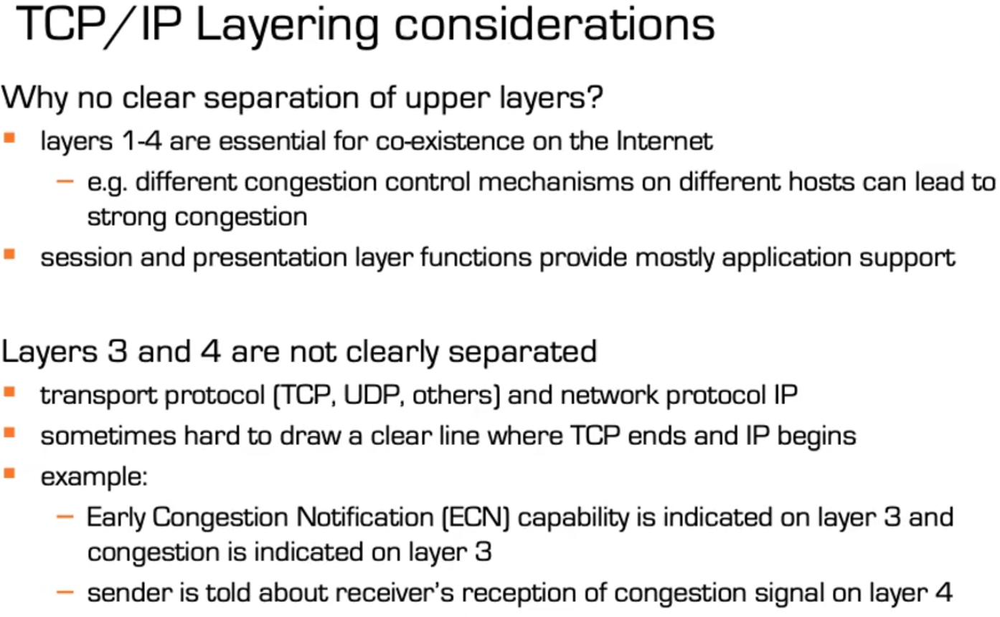

## Naming:
- **(N)-layer:** Abstraksjonsnivå for lag med definerte oppgaver tilbyr tjenester til laget over.
- **(N)-entity:** Implementasjonen (brukerne?) av protokollene definert for et lag. Aktive elementer på et lag. Kjørende kodebiter som benytter seg av maskinens ressurser. Entiteter som snakker med hverandre på samme lag er **peer entities**.
- **(N)-Service Access Point:** Et lag benytter seg av tjenestene til laget under og tilby tjenester til laget over. Hva slags tjenester et lag tilbyr er definert i denne *NSAP*en. Dette er en beskrivelse av disse tjenestene, interface, API. Et lag kan tilby flere NSAPer. F.eks. i lag 4 velger vi mellom to hovedprotokoller (TCP/UDP). 
- **(N)-Protocol:** N-entiteter interagerer med hverandre gjennom en N-protocol. Strenge og entydige regler. Protokollen definerer hvilken rekkefølge meldinger må sendes i - en entitet vil først finde en forbindelse til en annen entitet på samme lag på en annen maskin, så kan de etablere et forhold for hvordan de kan kommunisere (f.eks. hvor mye data de kan overføre på en gang) før de til slutt kan kommunisere som vanlig. En protokoll må også definere hvordan pakker skal sendes og hvordan unntak skal håndteres (f.eks. en pakke når ikke fram). Definerer **ikke** hvilke tjenester som leveres til laget over eller hvordan disse tjenestene skal leveres.
    - Protocol syntax: regler for formattering
    - Protocol semantics: regler for håndtering av uforventede hendelser
        - Begge disse må være likt mellom kommuniserende entiteter
    - PDU: Melding mellom to entiteter på samme lag som utfører en protokoll med hverandre 
        - Mer spesifikke begreper: 
            - Symbol: Lag 1
            - Frame: Lag 2
            - Packet: Lag 3
            - Message/datagram: Lag 4
            - Kombinasjon av andre begreper: Lag 5

### Hvordan sende pakker:
- Sending av brev analogi: Man addresserer mottakeren og sender den gjennom flere ledd før den kommer fram. Hvert mellomledd pakker ut litt og litt av addresseinformasjonen (analogisk: pakker ut kontinent, så land, så addresse, så person).
- Hver gang data sendes fra nivå N til N-1 legger nivå N til sine N-protokoller (som en header, her kan den også legge inn en checksum bakerst for å forsikre at dataen er valid). Hver gang data sendes fra nivå N til nivå N+1 pakker nivå N ut dataen fra nivå N-1.
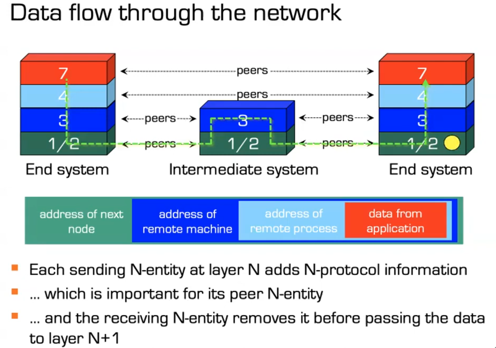
- Transport lag header (UDP): Bits sendes fra øverst til venstre ned til nederst til høyre. 64 bits/8 byte header. En port er en addresse en prosess fra lag 7 kan reservere for å bli identifisert etter mottak av en pakke fra den andre entiteten på lag 4 den skal sende til. Porten er internettets prosessaddresse. Source port er prosessaddressen til avsenderen. Destination port er prosessaddressen til mottakerprosessen. IPv4 kan ignorere checksum delen av UDP headeren.
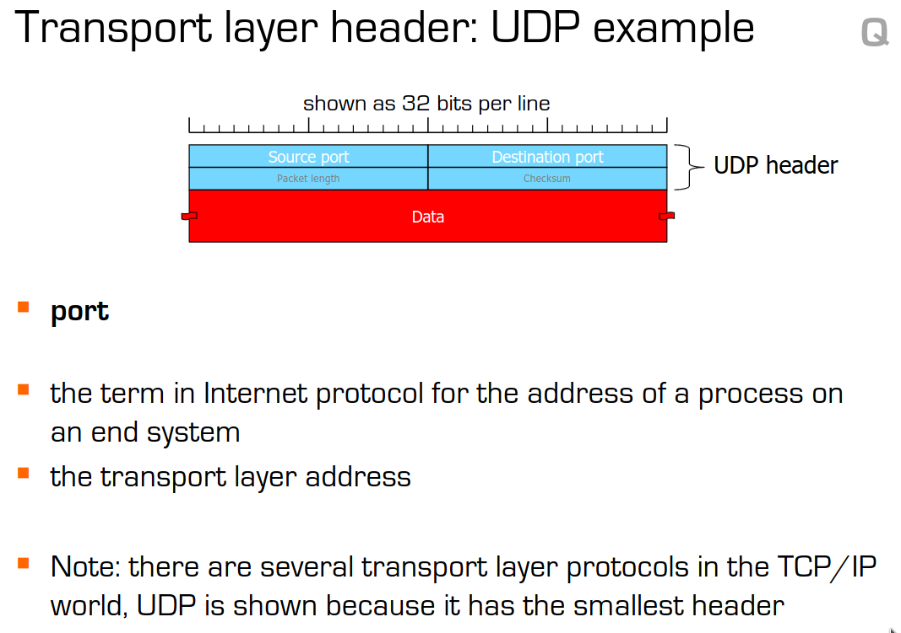
- Network lag header (IPv4 og IPv6): Version: sier om pakken er IPv4 eller 6 - mer om disse headersene senere

- Data link lag header (Ethernet): MAC addressene kan addressere både en IS eller et ES. Checksum for å sjekke at dataen har blitt overført riktig mellom nabonodene.
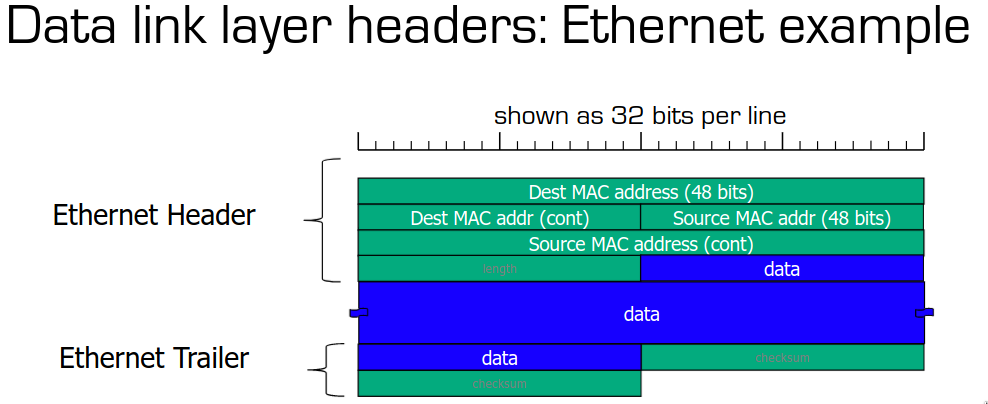

### Network byte order:
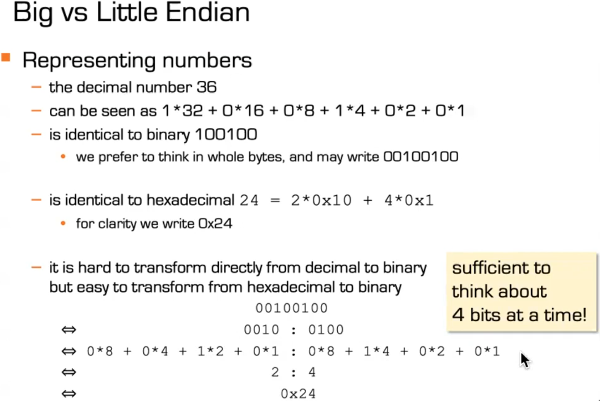

- Argument for big endian: Intuitiv skrivemåte for å skrive tall i vestlig skrivemåte der man skriver tall fra venstre til høyre - tall lengst til venstre har størst verdi. I en big endian maskin, hvis man putter endrer en `unsigned char byte[8]` sin `byte[0]` med `+=1` endrer man byten lengst til høyre med en (se bilde). 

- I tillegg ønsker man når man kommuiserer over nett å kunne sende de mest signifikante bitsene over nettet først siden da kan man allerede begynne å prosessere dataen før man har mottatt alt (analogi: telefonnummer - man kan se at telefonnummeret ligger i USA etter å ha lest 0d001... med big endian, mens hvis man hadde brukt little endian hadde man måttet lest hele telefonnummeret før man kan se landskoden). Denne analogien gjelder også for IP addresser ettersom de virker i stor grad på samme måte som telefonnummer (se bilde). OBS: pass på ved bruk av network byte order(big endian) på little endian maskiner ettersom dette kan skape bugs, bruk funksjoner for å konvertere byte order.

- Argument for little endian: Type casting i minnet på little endian maskiner er mye mer effektivt siden man uavhengig av hvor mange bytes som er satt av for en variabel alltid kan aksessere de første n bytesene av variabelen på samme måte (f.eks. hvis man har en long for tallet 0x81 og ønsker å konvertere dette til en short kan man bare ta de første 2 bytesene av longen og få det samme tallet)

### Addressering med MAC:
- MAC addresser brukes for kommunikasjon mellom to direkte naboer. Dette kan brukes for maskiner koblet til samme nettverk. For kommunikasjon med maskiner på andre nettverk brukes IP addresser. MAC addresser lagres ofte også i maskiners cache for å kunne kommunisere raskere.
- MAC addresser er ikke nødvendig i et true point-to-point nettverk. Dette er fordi hver gang lag 2 sender en pakke mha. tjenester fra lag 1 vil pakken gå rett til den fysiske forbindelsen som kommer til å sende bits til nabomaskinen og lag 2 addressen er ikke nødvendig fordi man kjenner identiteten til pakken kommer til å sendes til. Til tross for dette kan man fortsatt bruke MAC addressen i slike tilfeller siden de kan brukes for å identifisere maskiner over lengre perioder hvis de f.eks. kobler seg fra nettet og så kobler seg på igjen. Da slipper man å måtte oppdatere informasjonen om hvordan kommunisere med den noden på andre maskiner.
- Men for ekte broadcast nettverk der en maskin sender og andre lytter er det nødvendig å kjenne addressen til maskinen man ønsker å nå. Da kan senderen legge inn mottakeraddressen sånn at nodene på nettverket skjønner hvem som skal lese hvilke pakker.
- Det siste intermediate systemet som skal videresende pakken til et endesystem må også kunne finde riktig endesystem. Da må vi oversette fra IP addresse (lag 3) til Netadapter addresse (lag 2, f.eks. ethernet addresse). Dette må også gjøres for hver overgang fra et system til et annet, da må vi også ta hensyn til ulike datalinklagsprotokoller underveis som kan ha ulike hastigheter, underspesifikasjoner og lag2 addresseringsstiler (Wifi og ethernet har faktisk samme her, men DSL har forskjellig). Derfor kan vi ikke sende med informasjon om MAC addresser i pakkene på lag 3/4, dette må finnes ut lokalt.
- Noen maskiner kan omskrive sin MAC addresse + virtuelle maskiners MAC addresser er forskjellig fra maskinen de kjører på så den globalt unike IDen er ikke perfekt. 
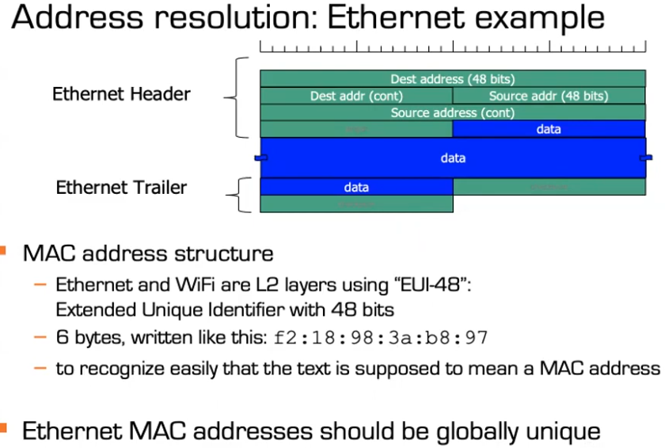
- Hvordan oversette MAC til IP?
    - **Direct mapping:** Legge IP addressene fra lag 3 inn i MAC addressen. Siden IPv4 er 32 bits og MAC addresser er 48 bits kan man ta hele IP addressen og legge det inn i MAC addressen, de første 16 bitsene i MAC addressen kan da være en prefix for lokale maskiner på det nettet. Da kan maskiner finne ut hvem pakken er ment til basert på IP addressen(?). Denne metoden virker ikke over internett siden IP addressen vil være for endesystemet, ikke den neste noden pakken skal sendes til.
    - **Mapping table:** Hver node har en tabell for IP addresser og MAC addresser som kan oppdateres og slås opp i for å se hvilke MAC addresser passer til IP addressen fra lag 3 headeren(?) før pakken kan sendes videre. Det finnes to måter å generere denne tabellen:
        - Manuelt vedlikehold: Mye arbeid men ikke urealistisk.
        - Hver gang en ny maskin kobles til internettet broadcaster de sin MAC og IP addresse sånn at alle mottakere kan oppdatere sine tabeller. OBS: maskiner som kobles til senere vil ikke ha noen informasjon om andre maskiner på nettverket.
        - **Address resolution protocol (ARP):** Hver maskin på nettet vedlikeholder en cache over sine direkte naboer som oversetter maskiners MAC addresser til IP addresser. Cachen benytter en timeout som gjør at dersom en maskin ikke har vært kontaktet over en gitt timeout sletter vi den fra cachen. Når en node ønsker å nå en gitt IP addresse i et nettverk mha. ARP vil avsenderen broadcaste *ARP requesten* over nettet som forespør den tilsvarende MAC addressen til IP addressen. Hvis noen svarer med sin MAC addresse oppdaterer avsenderen og mottakeren sine caches med hverandres data for lettere kommunikasjon i fremtiden, frem til forbindelsen timeouter. Andre noder ignorerer forespørselen.
        
            - Hva med kommunikasjon over større nettverk, da vil det jo forekomme enorme mengder ARP requests? 
                - Da kan vi bruke **proxy ARP**. Dette går ut på at vi deler opp nettverket i mindre nettverk. Hvert nettverk vil da ha en router som kjenner til de andre nettverkene som cacher et mapping table. Når noen broadcaster en ARP request og ingen maskiner på det lokale nettverket svarer vil det gå til routeren som sjekker om den allerede har den forespurte MAC addressen. Hvis den ikke har det vil den sende en forespørsel til de andre nettverkene. Hvis noen av de andre nettverkene svarer vil den oppdatere cachen sin sånn at neste gang noen broadcaster en ARP request slipper routeren å videreføre denne forespørselen til de andre nettverkene.
                - Proxy ARP er mulig men lite brukt i dag. I stedet anser vi bare hvert mindre nettverk som et separat nettverk som er koblet sammen gjennom en router. Når et endesystem da skal sende en melding bruker den IP addressen til mottakeren og sender pakkene til routeren som kobler oss til det andre nettet som inneholder mottakernoden.
        
        - **Reverse Address Resolution Protocol (RARP):** I stedet for å forespørre MAC addresser basert på sin IP addresse kan man forespørre IP addresesr basert på sin MAC addresse. Når et system kobler seg på internettet med RARP broadcaster den en *RARP request* for å finne sin IP addresse. Da vil *RARP server*en utdele en IP addresse så lenge den er tilgjengelig på LAN. Dette brukes heller ikke noe særlig i dag.

### Addressering med IP:
- Internettet består av subnetverk som deles inn i 5 klasser basert på de første bitsene i IP addressen. Disse nettverkene er også koblet til hverandre.
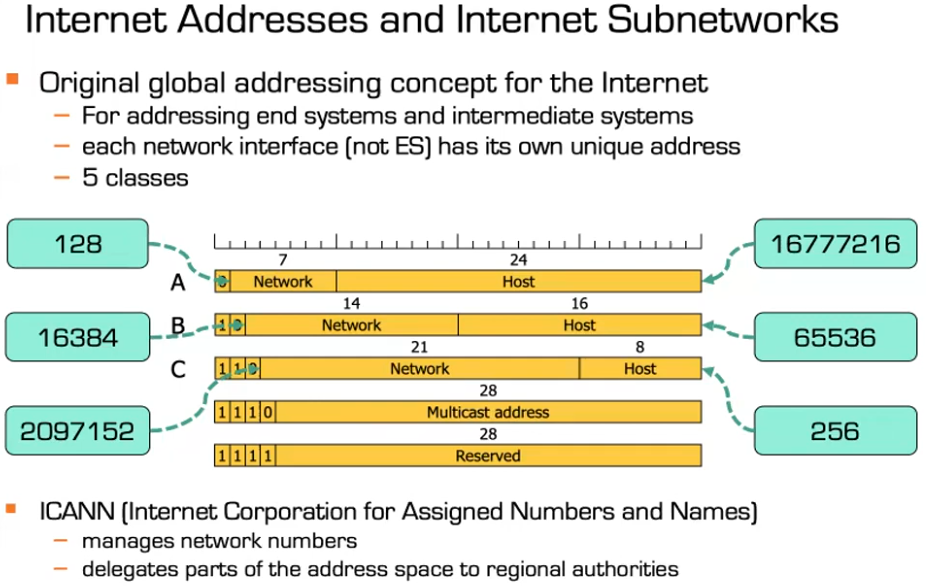
- En nettverkaddresse definerer hvem som tilhører hvilket nettverk, ikke hvordan nettverk er sammenkoblet. For å finne stien fra et nettverk til et annet *Routing*.
- Hvordan strukturere nettverk?
    - Gammeldags metode: Ha et stort nettverk hvor addresering til naboer gjøres på lag 2, f.eks. med proxy ARP. Men denne metoden holder ofte ikke siden nettverk ofte vokser utover den tildelte nettverksklassen. 
    - Alternativt: Dele opp nettverket i flere mindre deler som ligger under det større nettverket og bruke *routing* for å addressere noder internt. Men hvordan kan man skille de mindre nettverkene fra det store? Fjerne klasseindelingsbetydningen til den første biten i addressen. I stedet lager vi en lokal indikator for hvor mange bits vi bruker til nettverk/host. For å gjøre dette deler vi opp bitsene tidligere brukt for for host og deler den opp i en seksjon for undernettverk og en mindre andel bits for host. Da må vi også finne en måte å bestemme hvilke bits som definerer nettverket/subnetverket og hvilke som definerer hosten på nettverket - for dette bruker vi en subnet maske som er et tall med n antall 1 bits på rad i starten. Da kan vi gjøre en bitvis & operasjon mellom addressen og masken for å få ut subnet addressen. Hvis man router til subnet addressen kommer pakken fram til nettverksinngangen og man kan da se på resten av bitsene i addressen for å velge en maskin under subnettet. Routeren kan da bruke en algoritme for å gjøre 3 sjekker:
        - Hvis & operasjon mellom subnet maske og nettverksdelen av addressen er forskjellige betyr det at det er en pakke ment for et annet nettverk
        - Hvis & operasjon mellom subnet maske og nettverksdelen av addressen er like og & operasjon mellom subnet maske og subnetdelen av addressen er like er det en pakke som skal til det lokale systemet.
        - Hvis & operasjon mellom subnet maske og nettverksdelen er like, men & operasjon mellom subnet maske og subnetdelen av addressen er ulike er det en pakke til et annet subnetverk.
        

#### Classless InterDomain Routing (CIDR):
- Subnetverk er ikke bra nok
- Klasse A nettverk med 16 millioner addresser for mye i mange tilfeller
- Klasse C nettverk med 256 addresser for lite i mange tilfeller
- De fleste organisasjoner er intereserte i klasse B nettverk, men de er det ikke nok av (16384)
- Derfor kan vi i stedet ta ut deler av et 
- I stedet for å ha et stort nettverk med en organisasjon som forvalter det kan vi ta noen av det nettets subnetverk og skille dem ut for å selge dem separat fra dets tidligere nettverk. For å identifisere disse nettverkene kan vi fortsatt bruke den samme subnetmasken. Antall mulige hosts under en addresse er lik 2^antall 0 bytes i subnet masken dette kan brukes for å fordele nettverk med passende størrelser.
    - Med denne løsningen kan du ha flere nettverk med samme bits i starten, men med forskjellige subnet og subnetmasker. For å finne hvilket nettverk en pakke skal til i slike tilfeller bruker man ***longest mask*** prinsippet. Det vil si at da sendes pakkene til det nettverket med lengst subnetmaske som fortsatt returnerer en identisk streng etter & operasjon. 
    - For å bestemme hvilket nettverk en addresse tilhører må vi da gjøre & operasjoner med addressen og alle nettverk/subnettverk under ansvarsområdet til det originale nettet de splittet seg fra. I bildet under passer addressen til Router A, Router B, IKKE Router C (den femte biten i den tredje byten i addressen til Router C er 1, i addressen vi skal route må den være 0), IKKE unassigned og IKKE Router D. Da må vi velge den routeren addressen passer til som har lengst maske som er Router B (21bits).
    
- Netmaske separerer nettverk delen av addresser fra host delen av addresser.
    - For å få nettverk addressen fra en IP addresse med cidr kan man ta & operasjon mellom IP addressen og netmasken.
    - Hvordan skal endesystem bestemme om de skal sende pakker direkte til andre endesystem eller om de skal sendes til routeren, og hvordan bestemmer en router om den skal sende til en maskin den har ansvar for/en annen router? - Ta destination addresse og gjør en & operasjon med netmasken fra sitt eget nettverk interface. 
        - For endesystemer: Hvis resultatet av dette er likt subnet addressen kan man sende pakken til et lokalt endesystem (kanskje først ARP forespørsel for å finne systemet og så sende). Hvis ikke likt - send til nettverkets router. 
        - For routere: Spiller ikke noe rolle om pakken er lokal. Hvis & operasjon er lik subnet addresse - send direkte til endesystem (kanskje først oppslag i ARP cache/ARP forespørsel så sende til MAC addresse). Hvis ikke likt oppslag i routing tabell så send til annen router.
    

#### IPv6:
- Ingen får permanente addresser, de må lånes ut og byttes regelmessig. En fiks for dette er **NAT**, men den er ikke ideell siden det innebærer at vi ikke bruker en én til én oversettelse mellom IP addresser og maskiner.
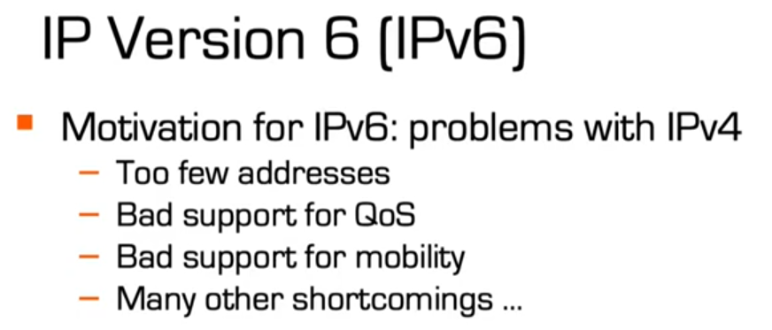
- Mål med IPv6: 
    - Øke skalerbarhet
    - Fikse begrensninger med ipv4
        - Integrere sikkerhet i ipv6
        - ipv4 pleide å bruke 3 bits for å indikere noen flagg for å effektivisere kommunikasjon, men dette måtte reinterpretert for andre mål. Med ipv6 skulle dette komme tilbake med traffikklasser og flow labels (identifisere om pakken var en del av en strøm eller separate enheter)
        - Multicasting: Sende en pakke fra en maskin til flere mottakere samtidig, pakken kan kopieres i nettet sånn at avsenderen slipper å sende flere ganger.
        - Mobility: Addresser skal kunne flytte seg fra et nettverk til et annet uten å måtte forandre routing tabeller over hele verden.
    - Kunne eksistere i samspill med ipv4
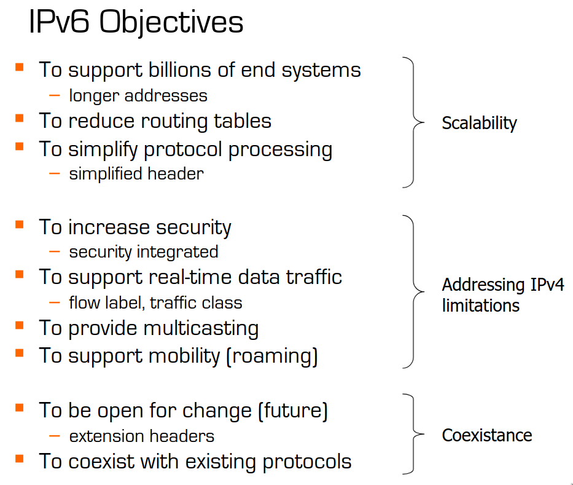
- **Headers**: 
    - IPv6 header er alltid 40 bytes lang. IPv4 uten noen options er 20 bytes, med options opp til 60 bytes. IPv6 trenger også options, men dette ligger i lag 4 dataen.
    - IPv4 støtter fragmentering av pakker fordi det var nyttig før, men i dag kan det føre til problemer når man har fragmenterte pakker en mottaker må prosessere siden hvis det oppstår en feil må man kanskje forkaste alle de andre pakkene også som er bortkastet båndbredde. IPv6 støtter ikke fragmentering. I stedet forhandler sender og mottaker seg fram til en maksimal lengde, men som i dag er mye lengre enn i gamle dager, som man så kan tilpasse pakkelengden etter. Hvis dette gjøres feil går pakkene tapt.
    - IPv4 brukte også checksums for å verifisere at pakker hadde blitt sendt riktig. Dette er forkastet i IPv6, gjøres heller i lag 2&4.
- IPv6 addresser: Ganske like IPv4 addresser. Ingen regler for hvordan network prefix, subnet identifier og interface identifier er delt opp, bruker også nettmasker for å identifisere dette.
    - For å komprimere IPv6 addresser kan man fjerne en stor blokk av nuller og erstatte dem med `::`. Merk at man ikke kan gjøre dette flere steder i samme addresse ettersom vi da ikke hadde kunnet vite hvor mange nuller hver `::` erstatter. Man kan også droppe ledende nuller (f.eks. `..:080a:.. -> ..:80a:..`)

- Hvordan tildele IPv6 addresser? noe med generering basert på MAC addresser ..?

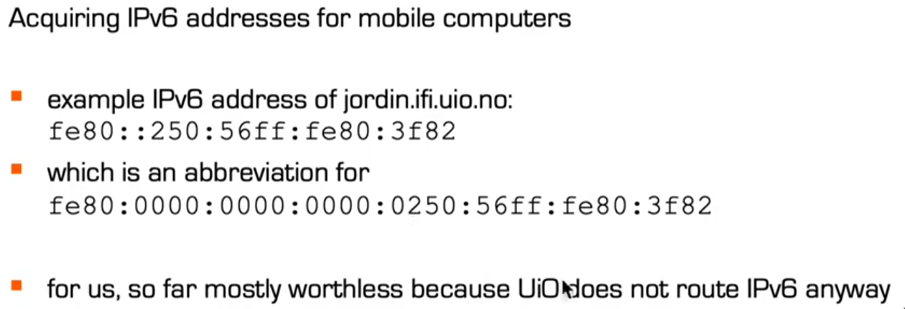

### Addressering i transportlaget:
- Transportlagets oppgaver:
    - Addressere prosesser 
    - Forvalte en forbindelse mellom applikasjoner (evt. sende uavhengige pakker (forbindelsesløst))
    - Overføre data mellom prosesser
    - Håndtering av feil
    - Pålitelig overføring av pakker
    - Flytkontroll sånn at applikasjonene ikke "drukner" i data
    - Metningskontroll sånn at ikke nettet får for mye data og pakker går tapt underveis
- Alle transportentiteter tilbyr et Service Access Point til applikasjonslaget. Applikasjonslaget er et interface som vi implementerer gjennom sockets. Addressen man tilbyr til applikasjonslaget defineres gjennom en port (16 bit integer). 
- Kommunikasjon med andre prosesser går først gjennom nettverkslaget før det prosesseres gjennom transportlagsprotokollene (som regel TCP eller UDP) på den andre maskinen. Dataen som flyter mellom prosessene har flere navn: TCP - message, UDP - datagram, ISO: Transport Protocol Data Unit(TPDU), mer generelt kan vi si "pakker". 
- Hvis en applikasjon ønsker å addressere en mottaker-applikasjon kan man benytte seg av en Transport Service Access Point(TSAP) som inneholder informasjon om hva slags informasjon man må videresende til din lokale transportentitet for å kunne opprette en forbindelse.
- Applikasjoner trenger også vite hvilke ports de skal lytte på. For servere kan vi slå opp i faste lister over hva hvilke porter brukes for. Merk at mange av tjenestene i disse listene kun støtter en transportprotokoll (f.eks. SSH støtter kun TCP), så mange av portnumrene kan brukes for andre tjenester så lenge det bruker en annen transportprotokoll. For klienter er portene til serverne kjent. Når en klient skal koble seg til en server velger klienten en port dynamisk og sender en `connect` forespørsel til serveren som inneholder denne dynamiskt valgte porten, da kjenner serveren porten til klienten.
    - Eksempel - En web browser klient vil spille av en video fra en webside: Serverne venter på predefinerte porter for sine tjenester. Klienten velger dynamisk port (et tall over 1024) for sin browser og sender en `connect` melding over TCP som inneholder den valgte porten, da kjenner serveren også porten til browseren. Så vil klienten starte video pluginen for browseren som også trenger en kontrollkanal for å bekrefte forbindelse til video serveren (over TCP), denne velges også dynamiskt. Etter serveren har godtatt denne tilkoblingen og lagret porten til video pluginen til browseren, kan video pluginen og video serveren dynamiskt velge en port for UDP kommunikasjon. De kan så sende en setup melding fram og tilbake for å lære hverandres porter som de til slutt kan bruke for selve videooverføringen over UDP. Nettverkslaget kan under denne prosessen overføre pakker fram og tilbake mellom klienten og serveren. Transportlaget har i oppgave å utføre multiplexing og demultiplexing over samme TSAP. Det vil si at transportlaget må sende og motta pakker over samme IP forbindelse og finne hvilke transportprotokoller hver pakke tilhører, hente ut portinformasjonen og videresende det til applikasjonslaget.

- ~64000 addresser for å tilby tjenester er ganske lite - hvordan utvide dette?
    - TCP: 
        - En `TCP tjeneste` tilbys gjennom en socket. En socket består av et *3-tuple* med 3 verdier: IP addressen til maskinen som tilbyr tjenesten, portnummeret for å finne fram til applikasjonen og en indikator om at socketen er for TCP.
        - En `TCP tilkobling` består av et *5-tuple* av 5 verdier: IP addressen til sender og mottaker, portaddressen til sender og mottaker og en indikator om at socketen er for TCP.
        - Med disse identifikatorene har vi vesentlig flere muligheter for å identifisere TCP tilkoblinger ettersom en tilkobling er unik så lenge én av disse faktorene er forskjellige.
    

### Addressering i applikasjonslaget (DNS):
- For å koble seg på en ekstern maskin: SSH/telnet(gammel). Denne bruker IP addresser med mindre noe annet er spesisert i `etc/hosts` (eller DNS server forbinder andre navn med  IP addresser). I denne filen kan du assosiere IP addresser med mer lesbare navn. For å forvalte slike assosiasjoner på en større skala bruker vi DNS (Domain Name System).
- DNS benytter et hierarkisk namespace, f.eks. `.com -> google.com -> mail.google.com`.
- Vi kan se på DNS som en distribuert database siden det ikke er én sentral server som tar var på disse forbindelsene.
- DNS bruker både UDP og TCP på port 53 der den lytter etter alle innkommende IP addresser.
- DNS servere må bruke TCP for å forsikre at oppdatteringer kommer fra kilder vi stoler på.
- DNS klienter får ikke bruke TCP. Dette er for å redusere server load, men er et sikkerhetsproblem ettersom det er lett å lure klienter til å ta i mot misvisende UDP pakker der man kan utføre man in the middle angrep.
- Naming hierarki: 13 root servers i verden. Root servere har ansvar for å oppløse oppslag til toppleveldomenene (.com, .gov, .no). Andre organisasjoner må så prøve å legge seg under et passende top level domene (f.eks. bedrifter under .com, universiteter under .edu, organisasjoner under .org, osv). Noder i dette treet har en tendens til å være veldig brede og grunne. Dette er fordi navn burde være korte og lette å huske. Internet council for assigned numbers and names (ICANN) har ansvar for root domenet og fordeler ansvar for underdomener som .no, .edu, .com. UNINETT har ansvar for .no. UIO har ansvar for .uio. UIO har også ansvar for .ifi. Organisasjoner kan velge om de vil fordele forvaltningen av domener eller beholde det sentralt.

- For forvaltere av et subtre har de ansvar for å besvare alle oppslag for navn under det subtreet, også om navnene eksisterer eller ikke. Det betyr ikke at alle DNS servere inneholder alle navn under det subtreet. Men de må vite hvem de kan videresende forespørselen til for å slå opp alle navnene. F.eks. har .no ansvar for å slå opp alle navn under .no, men ikke å lagre alle disse navnene. Alle forvaltere må også ha minst 2 servere i tilfelle krasj. Alle DNS servere må også kunne addressene til root servere. Root servere kjenner alle top level domener og alle serverne som betjener disse domenene.
- ICANN administrerer de 13 root serverne. 6 av disse er *anycasted*.

#### Oppslag i DNS:
- Rekursiv DNS query (gammel): Hver server på vei fra forespørrende klient til serveren som har svaret på queryen beholder forbindelsen/tilstanden oppe mens oppslaget prosesseres. Dette tillater serverne å cache svaret i det det returneres tilbake gjennom kjeden av servere. Men dette er en ganske dyr fremgangsmetode siden det bruker minne å opprettholde denne tilstanden.
- Iterated DNS query (ny): Omdirigerer oppslag tilbake til lokal DNS server for å unngå lagring av tilstand mens oppslaget prosesseres på andre servere. Da kan vi bare cache resultatet i den lokale serveren og ikke de andre som omdirigerte oppslaget.

- Konflikt - Caching vs. Freshness: Når en server oppdaterer sin informasjon, en annen server har cachet den gamle informasjonen og en klient søker opp nettsiden og får informasjonen fra serveren med cachet informasjon vil denne cachete informasjonen være utdatert. Løsning: Når en server cacher informasjon lagres dette kun en viss periode (mellom 5 min og 72t).
- Maskiner kan ha flere aliser (flere navn for en samme IP addresse), og et navn kan mappes til flere maskiner (et navn til flere IP addresser). Dette kan for eksempel brukes i *Content Delivery Networks (CDN)*. Siden DNS tillater *zoning* (servere gir forskjellig svar avhengig av vår lokasjon) kan vi basert på dette bestemme hvilken server vi skal bruke for et gitt navn. Et problem med dette er at DNS oppslag ikke alltid kan brukes for å identifisere forespørrerens faktiske lokasjon pga. `external resolvers`. F.eks. vil alle chrome DNS oppslag komme fra addressen `8.8.8.8` som er eid av google og dersom man prøver å redirigere til en server nærmere denne addressen vil det sannsynligvis ikke gi best resultat. På den andre siden kan dette være en fordel siden det gjør oppslag mer anonyme. Dette problemet kan ikke løses med DNS, men bedrifter kan gjøre private avtaler for å omgå dette problemet.
- Siden vi kun cacher informasjon om nettsider i en viss periode kan vi i løpet av denne perioden bestemme om det er nødvendig å bytte hvilke servere vi ønsker å benytte for fremtidige oppslag for nettsiden. For eksempel hvis det i løpet av et "cachings interval" gjøres mange oppslag til en spesifikk server kan vi ved neste gang den lokale DNS serveren må oppdatere cachen omdirigere til en annen server som opplever mindre belastning.
- DNS records:
    - Serial number: oppdateres hver gang noe endres.
    - Informasjon om hvor lenge en cache skal ta vare på data. 1800 - må oppdatere cachet etter 30 min. 900 - hvis et navneoppslag feiler må man vente 15 minutter før man kan prøve igjen. 960000 - etter 11 dager med gjentatte feilende forsøk på et navn skal det slettes fra recorden. 86400 - Minste tiden et navn må beholdes i cache før man har lov å spørre igjen eller oppdateringen spres til andre web servere.

- Multicast DNS - måte for maskiner å dele tjenester over lag 2 (ethernet/wifi)

